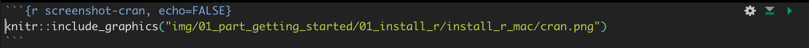

--- 
title: "R Notes"
author: "Brad Cannell"
date: "`r Sys.Date()`"
site: bookdown::bookdown_site
documentclass: book
bibliography: [book.bib, packages.bib]
link-citations: yes
csl: ama.csl
github-repo: brad-cannell/r_notes
url: 'https://brad-cannell.github.io/r_notes/'
description: "This is the Bookdown for Brad Cannell's R Notes."
---

# Welcome {-}

Welcome to Brad Cannell's R Notes!

This is a [Bookdown](https://bookdown.org/) version Brad Cannell's R Notes. I'm really making this "book" for me, but even better if you find it useful too!

Why am I doing this (as opposed to just keeping notes locally)?     

* Better organized (e.g., chapter structure and search)      
* Easy access -- just click on the bookmark on web browser      
* Practice using bookdown      
* Might help with R4Epi -- This can be sort of a sandbox for developing before I add things to R4Epi.     

<a rel="license" href="http://creativecommons.org/licenses/by-sa/4.0/"></a><br />This work is licensed under a <a rel="license" href="http://creativecommons.org/licenses/by-sa/4.0/">Creative Commons Attribution-ShareAlike 4.0 International License</a>.


## Organization {-}

These notes are loosely organized into the following parts:   

1. **Programming:** Things that have to do with optimizing code, writing functions, creating packages, and repeated operations.   

2. **Working with external files:** Things like data transfer, web scraping, PDF scraping, and using Officer to scrape Microsoft Office documents.   

3. **Data management:** Things related to manipulating/transforming/filtering data that is already in R.   

4. **Data analysis:** Things related to creating numerical summaries of data.

5. **Data visualization:** Things related to graphical summaries of data. A lot of this will be about ggplot. 

6. **Presenting results:**  Things related to making numerical and graphical summaries accessible outside of R. This can include webpages, static dashboards, PDF documents, Microsoft Office documents, ect. This does not include Shiny apps.  

7. **Shiny:** Things related to using Shiny to create interactive web apps. Eventually, this may need its own Bookdown project. 


<!--chapter:end:index.Rmd-->

# (PART) Programming {-}

<!-- This Rmd just creates a part heading in the table of contents -->

<!--chapter:end:chapters/01_programming/00_part_programming.Rmd-->

# Packages: Quick Start {#my-package-notes}

<!--
Hidden comments placeholder
-->

## ⭐️Overview

This chapter is my quick start guide for creating packages. 

**Using packages to create reproducible analyses**

This is proposed in the [Robert Flight's Blog](http://rmflight.github.io/posts/2014/07/vignetteAnalysis.html). I played around with it, but have decided that it's better to do analysis as a project rather than a package.   

* You can get most of the benefits of this technique - including Git and Packrat - using a project.   
* Just share the entire project folder with a collaborator and / or post on Github.   
* Packages require a bunch of extra work on the front end and are harder to keep up to date.   

## 🌎Useful websites

* [Hadley Wickham and Jenny Bryan's R Packages book](https://r-pkgs.org/)   
* [RStudio Tutorial](https://www.rstudio.com/resources/webinars/rstudio-essentials-webinar-series-programming-part-3/)
* [devtools package](https://github.com/r-lib/devtools)   
* [usethis package](https://github.com/r-lib/usethis)


## Step 1: Create the package project

1. File > New Project

2. New Directory > R Package

3. Give the package a new ([Hadley's naming strategies](http://r-pkgs.had.co.nz/package.html))

4. If you have R scripts written already, and wish to add them to the package, you can do so using the dialogue box titled "Create package based on source files"

5. Check "Create a git repository" (You can add later)

At this point RStudio should automatically open up the Rproj file we just created.   

* Make sure you have the latest version of R, then run the following code to get the packages you’ll need:

```{r eval=FALSE}
install.packages(c("devtools", "roxygen2", "testthat", "knitr"))
```

Use the following code to access new devtools functions as I develop them. This is particularly important during the development of the book.

```{r eval=FALSE}
devtools::install_github("hadley/devtools")
library(devtools)
has_devel()
```


### Step 2: Modify the description file

Open the description file and make some changes. Here is an example:

```{r eval=FALSE}
Package: freqtables
Type: Package
Title: Make Quick Descriptive Tables For Categorical Variables
Description: Quickly make tables of descriptive statistics (i.e., counts, 
    percentages, confidence intervals) for categorical variables. This 
    package is designed to work in a tidyverse pipeline, and consideration
    has been given to get results from R to Microsoft Word ® with minimal pain.
Version: 0.1.0
Authors@R: person("Brad", "Cannell", email = "brad.cannell@gmail.com",
  role = c("aut", "cre"))
Maintainer: Brad Cannell <brad.cannell@gmail.com>
URL: https://github.com/brad-cannell/freqtables
BugReports: https://github.com/brad-cannell/freqtables/issues
License: MIT + file LICENSE
Encoding: UTF-8
LazyData: true
RoxygenNote: 7.0.2
Imports: 
    dplyr
```

* Remember that Title Case is required for the Title

* **Do Not** use `library(package)` in R scripts - instead add package dependencies to the `Imports` or `Remotes` field in the DESCRIPTION. **Do** use `library(package)` in vignette .Rmd files, and **do not** add these package dependencies to the DESCRIPTION

* If we added R scripts to the package in Step 1, bullet 4 above, we need to open them now and make sure to remove all the library functions. Note that these R scripts are not linked to the original R scripts. In other words, if I make a change to props.R inside my package, those changes are reflected in the original props.R script.

* If you use MIT license, remember to add the license file (without file extension) to the main package directory.

* When adding CRAN packages to imports, you must first make sure they are installed.

* <a href = "https://github.com/hadley/devtools/blob/master/vignettes/dependencies.Rmd" target = "_blank">Instructions for installing dependencies from sources other than CRAN are given here</a>.

### Working with R scripts

1. Don't write or alter your functions in the console as you would in a typical interactive session. If you do, it's easy for the version you're using interactively and the version you are actually including in your package to get out of sync. Instead, _load_ the package.

2. Click the build tab > More > Load All, or `devtools::load_all`, or shift + cmd + L


## Step 3: Writing help pages

Help pages are contained in .Rd files saved in the man folder. It's best practice to use `roxygen` with your script files to automatically generate the .Rd files. Doing so helps to keep your scripts and your help pages in sync.

To use roxygen:

1. Make sure the R script you want to document is active.

2. Click Project Options > Build Tools > Generate documentation with Roxygen

3. Place your cursor in the function you want to document

4. Insert a Roxygen skeleton with the keyboard shortcut cmd + alt + shift + R

5. After you've filled in the skeleton click Build > More > Document, or use the keyboard shortcut shift + cmd + D. RStudio will then automatically generate the help pages in your man folder.

6. Click the build tab > More > Load All, or `devtools::load_all`, or shift + cmd + L

7. Check your help page by typing ?function_name in the console.

### Example `roxygen` header

```{r eval = FALSE}
#' @title Compact Table of Summary Statistics
#'
#' @description  Based on Stata's "tabstat" command. "tabstat displays summary
#'  statistics for a series of numeric variables in one table.  It allows you
#'  to specify the list of statistics to be displayed.  Statistics can be
#'  calculated (conditioned on) another variable.  tabstat allows substantial
#'  flexibility in terms of the statistics presented and the format of the
#'  table" (Stata, 2016).
#'
#' @param x A continuous variable.
#' @param digits Rounds the values returned to the specified number of decimal
#'  places (default 3).
#' @param stats Return specified statistics. Options include:
#'  \describe{
#'    \item{n}{Count of nonmissing values of x}
#'    \item{nmiss}{Count of missing values of x}
#'    \item{ci}{95 percent confidence interval for the mean of x}
#'    \item{sum}{Sum of x}
#'    \item{max}{Maximum value of x}
#'    \item{min}{Minimum value of x}
#'    \item{range}{(Maximum value of x) - (minimum value of x)}
#'    \item{sd}{Standard deviation of x}
#'    \item{var}{Variance of x}
#'    \item{cv}{Coefficient of variation (sd / mean) of x}
#'    \item{sem}{Standard error of the mean of x}
#'    \item{skew}{Skewness of x}
#'    \item{kurt}{Kurtosis of x}
#'    \item{p1}{1st percentile of x}
#'    \item{p5}{5th percentile of x}
#'    \item{p10}{10th percentile of x}
#'    \item{p25}{25th percentile of x}
#'    \item{p50}{Median value of x}
#'    \item{median}{Median value of x}
#'    \item{p75}{75th percentile of x}
#'    \item{p90}{90th percentile of x}
#'    \item{p95}{95th percentile of x}
#'    \item{p99}{99th percentile of x}
#'    \item{iqr}{Interquartile range (p75 - p25)}
#'    \item{q}{Equivalent to specifying p25 p50 p75}
#'  }
#'
#' @return A data frame. By default, the data frame contains the variable name
#'  and mean.
#' @export
#'
#' @references Stata 14 help for tabstat
#'  \url{http://www.stata.com/help.cgi?tabstat}
#'
#' @examples
#' data(mtcars)
#'
#' # Single univariate analysis with Defaults
#' tabstat(mtcars$mpg)
#'
#' # Single univariate analysis with all stats
#' tabstat(mtcars$mpg, stats = c("n", "nmiss", "ci", "sum", "max", "min",
#' "range", "sd", "var", "cv", "sem", "skew", "kurt", "p1", "p5", "p10",
#' "p25", "p50", "median", "p75", "p90", "p95", "p99", "iqr", "q"))
```

### Documenting Package:

You can use roxygen to provide a help page for your package as a whole. <a href = "http://r-pkgs.had.co.nz/man.html" target = "_blank">More information is available from Hadley here</a>.

**At this point, you have a usable package**

### Once package is complete (ish)

1. Update documentation (help pages). Build > More > Document, or shift + cmd + D.

2. Check the package by clicking Build > Check. This will look for common package problems

3. Click Build > Build & Reload. That will build the package and install it in your local package directory

4. If you want to copy the package to send to someone else, click Build > More > Build source package. RStudio will build the package and save it as a .tar.gz file. You can then send it to another user to be installed on their system.

5. If you are using GitHub, you need to commit changes and then push them to GitHub. More information about using Git and GitHub are available <a href = "http://r-pkgs.had.co.nz/git.html" target = "_blank">here</a>. Other users can install your package directly from GitHub with `install.packages("devtools")` followed by `devtools::install_github("username/packagename")`.

### Notes about package notes:   

* Because packages are almost always a work in progress, you will want to add notes to yourself about the project in the source package that you don't want others to see. You can do this by creating a notes directory, and then listing that directory in `.Rbuildignore`. You can add to buildignore using `usethis::use_build_ignore("notes")`. More information is available [here](http://r-pkgs.had.co.nz/package.html).

* Also make sure to add NOTES to `.gitignore` with `usethis::use_git_ignore("notes")`

* Use NOTES for notes, but not tasks. Why or how, but not what. Tasks go into issues.

* There is a NOTES template in R/Templates.


## Step 4: Synchronize with GitHub

Again, details are available in <a href = "http://r-pkgs.had.co.nz/git.html" target = "_blank">Hadley Wickham's Book</a>.   

Note: to exculde files from add them to `.gitignore` manually, or by clicking Git > More > Ignore.

1. If you didn't check "Create a git repository" in step 1, you'll need to create one now. Do so by clicking Project Options > Git/SVN > Version Control System.   

2. May need to restart R

3. [Create a README.md file](http://r-pkgs.had.co.nz/release.html#readme) (`devtools::use_readme_rmd()`)

* Note: This only works if you set up the project as a package. Do this, even if you don't intend to create a package. There are just nice extra tools avaialable when you select project type > R Package.

4. Create a new repo on GitHub: https://github.com/new. Give it the same name as your package, and include the package title as the repo description. Leave all the other options as is, then click Submit.   

5. Open a shell, then type `git remote add origin https://github.com/mbcann01/dataclean.git`   

6. Modify DESCRIPTION to add URL and BugReports fields that link to your new GitHub site.

7. Save the file and commit (with the message “Updating DESCRIPTION to add links to GitHub site”)

8. Open a shell, then type `git push -u origin master`

9. Enter username `mbcann01` and password `asdf1234`

10. Go to your GitHub page and look at the DESCRIPTION

### Example: Modify Description

```{r eval = FALSE}
URL: https://github.com/mbcann01/dataclean
BugReports: https://github.com/mbcann01/dataclean/issues
```

### Example Installation instructions for README:

All files can be viewed directly on Github. To install this package locally, simply use `devtools`:

```{r eval = FALSE}
library(devtools)
devtools::install_github("mbcann01/detectPilotTest")
library(detectPilotTest)
browseVignettes("detectPilotTest")
```


## Step 5: Testing

Testing is an important part of programming. For detailed information on testing see the appropriate chapter in <a href = "http://r-pkgs.had.co.nz/tests.html" target = "_blank">Hadley Wickham's Book</a>.   

Further guidance is available <a href = "https://journal.r-project.org/archive/2011-1/RJournal_2011-1_Wickham.pdf" target = "_blank">at the R Journal</a>.   

Get started with `devtools::use_testthat()`.

1. Create test file. Must be in `tests/testhat`. File name should start with test_ and the function name. For example, `test_check_catvars`.   

2. Modify your code or tests   

3. Test your package with Ctrl/Cmd + Shift + T or `devtools::test()`.   

4. Repeat until all tests pass.


## Vignettes

There are some great vignette resources on the internet: 

* <a href = "http://r-pkgs.had.co.nz/vignettes.html" target = "_blank">Chapter on vignettes in Hadley's Package book</a>   

* <a href = "ftp://cran.r-project.org/pub/R/doc/contrib/Leisch-CreatingPackages.pdf" target = "_blank">Leisch's creating R packages tutorial</a>   

* <a href = "http://rmflight.github.io/posts/2014/07/vignetteAnalysis.html" target = "_blank">Flight's article on creating an analysis as a package and vignette</a>   


### To create a vignette:   

* run `usethis::use_vignette("my-vignette")`

* Open `vignettes/my-vignette.Rmd`

* Create the vignette

* Unlike R scripts, install and load packages directly in the vignettes.

* Knit the vignette - The default action will be to create a version of the vignette that can be viewed in RStudio. However, `devtools::install_github()` (and friends) will not build vignettes by default because they’re time consuming and may require additional packages. So, in order to be able to view the vignette in RStudio, you must use vignettes = TRUE, e.g., devtools::install_github("brad-cannell/bfuncs", build_vignettes = TRUE) instead.

* Use `devtools::build_vignettes()` to create an html version of the vignette in `inst/doc` that you can provide a link to on your Github README page. By default, these folders will be added to .gitignore. Remove them from .gitignore to be able to view/use them on Github. Create a rawgit version of the html vignette file, and providea link to it on README.

* use use `devtools::build()` to create a package bundle with the vignettes included. RStudio’s “Build & reload” does not build vignettes to save time.

* When you add or update vignettes, push to Github again.

### Vignette Notes:

This builds the vignettes, and is probably fine for a regular package of functions. However, when using packages as a means for reproducible, self-contained analysis projects, the vignettes have greater importance, and by default are not easily accessible.   
Need to find a way to make the vignettes more "front and center"   

* Create a help page for the entire package that includes links to the vignettes?

* Include links to the README.md file and upload to GitHub (with the data sets excluded)?

* Remember to use `system.file()` when reading in data inside a code chunk. If you have trouble getting it to work, try build & reload.

* To save a data frame to `data/` inside a vignette, you can use the <a href = "https://github.com/krlmlr/rprojroot" target = "_blank">rprojroot package</a>. use `rprojroot::find_root("DESCRIPTION")`

## Adding and documenting data

The explanation in the [R Packages book](https://r-pkgs.org/data.html) is good, short, and easy to follow.


## Errors, warnings, notes

Below are some common errors, warnings and notes I've encountered during build tests.

> W  checking for unstated dependencies in examples ...
   'library' or 'require' call not declared from: ‘tidyverse’
E  checking examples (707ms)
   Running examples in ‘freqtables-Ex.R’ failed
   The error most likely occurred in:
   
I got this error because I had `library(tidyverse)` in the @examples section of my roxygen2 header in one of my R scripts, but I did not have `tidyverse` in the Imports section of my DESCRIPTION file. I could add `tidyverse` to the DESCRIPTION file (`usethis::use_package("tidyverse", type = "Imports")`). However, in this case I chose to use `library(dplyr)`, which was already in the Imports section of my DESCRIPTION file, instead.

>
W  checking dependencies in R code (369ms)
   '::' or ':::' import not declared from: ‘rlang’

To fix this one simply run the following code in the console: `usethis::use_package("rlang", type = "Imports")`

> Warning: ‘inst/doc’ files ... ignored as vignettes have been rebuilt.

Just ignore this one.

> Warning in strptime(xx, f <- "%Y-%m-%d %H:%M:%OS", tz = tz) : unknown timezone 'zone/tz/2017c.1.0/zoneinfo/America/Chicago'

Just ingnore this one. It's a problem with my computer, not with the package code.

> Non-standard files/directories found at top level: ‘develop_test_table.Rmd’ ‘develop_test_table.nb.html’

Need to delete these files when I'm done developing chi-square test.

> Prevents R CMD check: "no visible binding for global variable ‘.’"

Put the following (for example) directly inside the function definition in the R script where the function is defined:

```{r eval=FALSE}
# ------------------------------------------------------------------
# Prevents R CMD check: "no visible binding for global variable ‘.’"
# ------------------------------------------------------------------
n = n_total = prop = t_crit = se = lcl_wald = ucl_wald = percent = NULL
```

> N  checking R code for possible problems (1.8s)
   get_group_n: no visible global function definition for ‘%>%’
   Undefined global functions or variables:
     %>%
     
[Info on fixing this issue](http://r-pkgs.had.co.nz/namespace.html#imports)

Short answer: Add the following directly inside the roxygen2 header in the R script where the function is defined: `@importFrom dplyr %>%`. You must also make sure that it gets to the NAMESPACE. Run `usethis::use_namespace()` and then `devtools::document()` to get it into NAMESPACE.


<!--
Clean up and add session info
-->

```{r echo=FALSE}
rm(list = ls())
```

```{r echo=FALSE}
sessionInfo()
```

<!--chapter:end:chapters/01_programming/packages_01_quick_start.Rmd-->

# Creating Rmd Templates

<!--
Hidden comments placeholder
-->

## ⭐️Overview

This file contains notes on creating Rmd templates for RStudio. 

1. In RStudio, click on the "new file" button.   
2. Click "R Markdown..."   

```{r echo=FALSE}
knitr::include_graphics("img/01_programming/packages_rmd_templates/new_rmd.png")
```

3. Click "From Template" in the left sidebar menu.   
4. A list of Rmd templates appears in the "Template:" list.   

```{r echo=FALSE}
knitr::include_graphics("img/01_programming/packages_rmd_templates/list_of_rmd_templates.png")
```

You can create your own templates and add them to this menu, which can be really handy! Below, I describe how to do that. 

**Important:** Rmd templates can only be added to RStudio's template list by adding the Rmd template to a package and then installing that package on your computer. Read Hadley Wickham and Jenny Bryan's [R Packages book](https://r-pkgs.org/) for an overview of creating R packages. 


## 🌎Useful websites

* https://bookdown.org/yihui/rmarkdown/document-templates.html   
* https://r-pkgs.org/   


## Create a package

See [R Packages](https://r-pkgs.org/) and/or [my R packages notes](#my-package-notes). 


## Add a template to your package

**Step 1.** Create directory for template

> Templates are located within the `inst/rmarkdown/templates` directory of a package. This structure can be generated automatically with the `use_rmarkdown_template()` function from the `usethis` package. It is possible to contain multiple templates in a single package, with each template stored in a separate sub-directory.

**Step 2.** 

For example, the "No Output" Rmd template can be viewed at: https://github.com/brad-cannell/templates/blob/master/inst/rmarkdown/templates/no_output/skeleton/skeleton.Rmd   

**Step 3.**  Change the name of the folder in `inst/rmarkdown/templates` from `template-name`. For example, `no_output`.

**Step 4.**  Open the folder you just renamed and update `template.yaml`. 

* The value you pass to the `name:` parameter will determine how the template is listed in RStudio's template list. For example, `name: No Output`.

* The value you pass to the `description:` parameter appear as a tool tip when you hover your mouse over the template's name in RStudio's template list. For, example, `Brad Cannell's template for an Rmd file with no output.`

**Step 5.** Create (or copy and paste) your Rmd template file into `skeleton/skeleton.Rmd`.

<p class="note"> 🗒**Side Note:** If you already have a template in your package, you can create another one by pasting `usethis::use_rmarkdown_template()` in the console again and following the steps above. </p>

<!--
Clean up and add session info
-->

```{r echo=FALSE}
rm(list = ls())
```

```{r echo=FALSE}
sessionInfo()
```

<!--chapter:end:chapters/01_programming/packages_rmd_templates.Rmd-->

# Tidy Evaluation

Created: 2017-06-24 <br> Updated: `r Sys.Date()`

<!--
Hidden comments placeholder
-->

```{r echo=FALSE}
knitr::include_graphics("https://picsum.photos/200/300")
```

## ⭐️Overview

This chapter is about tidy evaluation.


## 🌎Useful websites

* [Tidy evaluation book](https://tidyeval.tidyverse.org/)   
* [Programming with dplyr](https://dplyr.tidyverse.org/articles/programming.html)   
* [Using ggplot2 in packages](https://ggplot2.tidyverse.org/articles/ggplot2-in-packages.html)   
* [Rlang adds curly-curly](https://www.tidyverse.org/blog/2019/06/rlang-0-4-0/)   
* [Advanced R, metaprogramming](https://adv-r.hadley.nz/metaprogramming.html#)   


## 📦Load packages

```{r message=FALSE}
library(dplyr, warn.conflicts = FALSE)
library(tidyr, warn.conflicts = FALSE)
library(purrr, warn.conflicts = FALSE)
```


## 🔢Simulate data 

```{r}
# Do this later
# set.seed(123)
# df <- tibble(
#   x = rnorm(26),
#   y = letters
# )
```

## Load Starwars data

```{r}
data(starwars)
```


**Tidy Eval** is as system for **programming**, as opposed to working interactively, with **dplyr**.

Tidy Eval is all about **quoting**. Not in the `""` sense, which is to create a character string. Rather, Quoting is the action of capturing an expression instead of evaluating it. This is similar to the way formulas work in R. For example:

```{r}
# Computing the value of the expression:
toupper(letters[1:5])
```

```{r}
# Capturing the expression:
quote(toupper(letters[1:5]))
```

**Don't forget:** When using quoted expressions, or **quotures** inside functions, you must **unquote** them where you want the expression evaluated. You can unquote with `!!` or unquote-splice with `!!!`.

You can also use the curly-curly syntax to unquote: `{{}}`. I'm still not clear on when to use one vs. the other. 


## Key Functions {#key_functions}

* `.data` pronoun 

    + Not officially part of Tidy Eval (part of rlang). 
    
    + However, useful to keep in mind in situations where you might be programming over multiple data frames. If you're in that situation, go check out the _Pragramming with dplyr_ link above for more details.

* `quo()`

    + This is sort of the foundational function in Tidy Eval. It creates a class **quoture** object, which is a special type of formula.
    
    + quo() captures expressions when outside of user-defined functions.

```{r}
# What does quo() return?
quo(species) # Where species is a variable in the Starwars tibble
```

```{r}
# Basic usage of quo() in function
freq_table <- function(df, x, ...) {
  df %>%                             # No quoting and unquoting necessary for the tibble
    group_by(!!x) %>%                # Don't forget to unquote (!!) where you want the quoture evaluated
    summarise(N = n()) %>%           # Calculate freq
    top_n(3, N)                      # Return top 3 results
}

freq_table(df = starwars, x = quo(species))
```

* `enquo()`

    + If you don't want the user of your function to be able to pass the variable name as an argument without wrapping in `quo()`, that's where `enquo()` comes in.
    
```{r}
# Basic usage of enquo() in function
freq_table <- function(df, x, ...) {
  x <- enquo(x)                      # Capturing function argument and turning it into a quoture
  df %>%                             
    group_by(!!x) %>%                
    summarise(N = n()) %>%           
    top_n(3, N)                      
}

freq_table(df = starwars, x = species) # Notice we no longer need to wrop species with quo()
```

* `quos()`

    + Use `quos()` with `...` when you want to pass multiple variables / arguments / expressions into your function.
    
    + Must unquote-splice `!!!` in your function to evaluate.
    
```{r}
# What does quos() return?
quos(species, name) # Where species and name are variables in the Starwars tibble
```

You can iterate over the list of quotures returned by `quos()`
    
```{r}
my_quos <- quos(species, name)
for(i in seq_along(my_quos)) {
  print(my_quos[[i]])
}
```

Don't forget to unquote-splice with `!!!`

```{r}
# Basic use of quos() in a for loop
my_quos <- quos(species, name)
for(i in seq_along(my_quos)) {
  summarise(starwars, n_miss = sum(is.na(!!my_quos[[i]]))) %>% print # Can use !! or !!! in this case
}
```

```{r}
# Basic usage of quos() in function
freq_table <- function(df, ...) {    # Notice we dropped the "x" argument
  x <- quos(...)                     # Capturing function argument and turning it into a quoture list
  df %>%                             
    group_by(!!!x) %>%               # Must use unquote-splice (!!!) in this case
    summarise(N = n()) %>%
    ungroup() %>% 
    slice(1:5)                      
}

freq_table(df = starwars, species, hair_color)
```

* `quo_name()`

    + Sometimes we want to convert the argument to a string for use in our function output. For example, we may want to dynamically create variable names inside the function.

```{r}
# What does quo_name return?
quo_name("height") # Input must be a string or a quoture
```

```{r}
# What does quo_name return?
height <- quo(height)
quo_name(height) # Input must be a string or a quoture
```

```{r}
# Basic usage of quos() in function
continuous_table <- function(df, x) {
  x2 <- enquo(x)                             # Must enquo first
  mean_name <- paste0("mean_", quo_name(x2))
  sum_name  <- paste0("sum_", quo_name(x2))
  
  df %>% 
    summarise(
      !!mean_name := mean(!!x2, na.rm = TRUE), # Must use !! and := to set the variable names
      !!sum_name  := sum(!!x2, na.rm = TRUE)
    )
}

continuous_table(starwars, height)
```

* `rlang::sym()`

    + Takes a string as an input and turns it into a symbol

```{r}
my_col <- "height"
rlang::qq_show(
  starwars %>% 
    summarize(
      mean(my_col)
    )
)
```

Doesn't work because R will look for a variable named "my_col" in the data frame "starwars".

```{r}
my_col <- "height"
rlang::qq_show(
  starwars %>% 
    summarize(
      mean(!!my_col)
    )
)
```

Doesn't work because R will try to calculate the mean of the character string "height".

```{r}
my_col <- rlang::sym("height")
rlang::qq_show(
  starwars %>% 
    summarize(
      mean(!!my_col)
    )
)
```

This looks like what we would type manually.

```{r}
my_col <- rlang::sym("height")
starwars %>% 
  summarize(
    mean = mean(!!my_col, na.rm = TRUE)
  )
```

And it works as expeccted

* `rlang::syms()`

    + Like sym, but can convert multiple strings into a list of symbols
    
```{r}
my_cols <- rlang::syms(c("height", "mass"))
rlang::qq_show(
  starwars %>% 
    summarize(
      mean(!!my_cols)
    )
)
```

Notice that unquoting with !! returns a list of symbols. To unlist them, we must use the splice operator.

```{r}
my_cols <- rlang::syms(c("height", "mass"))
rlang::qq_show(
  starwars %>% 
    summarize(
      mean(!!!my_cols)
    )
)
```

Of course, to make this meaningful we need to map it over height and mass

```{r}
my_cols <- rlang::syms(c("height", "mass"))

summarise_avg <- function(data, col) {
  col <- enquo(col)
  data %>% 
    summarise(avg = mean(!!col, na.rm = TRUE))
}

results <- purrr::map_df(my_cols, summarise_avg, data = starwars)
results
```


## Example using Tidy Eval in For Loop {#for_loop}

In this example, I'm creating a table of summary statistics using the Starwars data. The table will compare some simple characteristics of the characters by species.

First, I'm going to reclassify every character as Human or Not Human

```{r}
starwars <- mutate(starwars, human = if_else(species == "Human", "Yes", "No", NA_character_))
```

Now I'm going to create the table shell

```{r}
vars = 3        # Number of vars
rows = vars + 1 # Additional row for group sample size
table <- tibble(
  Variable = vector(mode = "character", length = rows),
  Human = vector(mode = "character", length = rows),
  `Not Human` = vector(mode = "character", length = rows)
)

# N for Human
table[1, 2] <- paste0(
  "(N = ",
  filter(starwars, human == "Yes") %>% nrow() %>% format(big.mark = ","),
  ")"
)

# N for Not Human
table[1, 3] <- paste0(
  "(N = ",
  filter(starwars, human == "No") %>% nrow() %>% format(big.mark = ","),
  ")"
)
```

```{r}
table
```

Finally, I'll fill in the table using a for loop. In this case, I just want to compare the mean height, mass, and birth year of humans and non-humans.

```{r}
vars <- c(quo(height), quo(mass), quo(birth_year)) # Create vector of quotures for variables of interest

for(i in seq_along(vars)) {
  table[i + 1, ] <- starwars %>%                             # Chunk of table to receive loop output
    filter(!is.na(human)) %>% 
    group_by(human) %>% 
    summarise(Mean = mean(!!vars[[i]], na.rm = TRUE)) %>%    # Use !! with vars[[i]]
    mutate(Mean = round(Mean, 1) %>% format(nsmall = 1)) %>% 
    tidyr::spread(human, Mean) %>% 
    mutate(Variable = quo_name(vars[[i]])) %>%               # Use quo_name to get variable name for first column
    select(Variable, Yes, No)
}
```

```{r}
table
```

This works! How can I keep from having to type quo around every variable?

```{r}
vars <- quos(height, mass, birth_year)

for(i in seq_along(vars)) {
  table[i + 1, ] <- starwars %>%                             # Chunk of table to receive loop output
    filter(!is.na(human)) %>% 
    group_by(human) %>% 
    summarise(Mean = mean(!!vars[[i]], na.rm = TRUE)) %>%    # Use !! with vars[[i]]
    mutate(Mean = round(Mean, 1) %>% format(nsmall = 1)) %>% 
    tidyr::spread(human, Mean) %>% 
    mutate(Variable = quo_name(vars[[i]])) %>%               # Use quo_name to get variable name for first column
    select(Variable, Yes, No)
}
```

```{r}
table
```


## Example using Tidy Eval in Functions {#functions}

In this example, I'm creating a table of summary statistics using the Starwars data. The table will compare some simple characteristics of the characters by species.

First, I'm going to reclassify every character as Human or Not Human

```{r}
starwars <- mutate(starwars, human = if_else(species == "Human", "Yes", "No", NA_character_))
```

Now I'm going to create the table shell

```{r}
vars = 3        # Number of vars
rows = vars + 1 # Additional row for group sample size
table <- tibble(
  Variable = vector(mode = "character", length = rows),
  Human = vector(mode = "character", length = rows),
  `Not Human` = vector(mode = "character", length = rows)
)

# N for Human
table[1, 2] <- paste0(
  "(N = ",
  filter(starwars, human == "Yes") %>% nrow() %>% format(big.mark = ","),
  ")"
)

# N for Not Human
table[1, 3] <- paste0(
  "(N = ",
  filter(starwars, human == "No") %>% nrow() %>% format(big.mark = ","),
  ")"
)
```

```{r}
table
```

Finally, I'll fill in the table using a user-defined function. In this case, I just want to compare the mean height, mass, and birth year of humans and non-humans.

```{r}
my_stats <- function(...) {
  vars <- quos(...)                                           # Creates a list of quotures from variable names
  temp <- get("table")                                        # Grabs a copy of the table shell from the environment
  temp <- temp[0, ]                                           # Only keep the column headers
  
  for(i in seq_along(vars)) {                                 # Loop over all variables in ...
    out <- quo(!!vars[[i]])                                   # Not necessary, but makes more readable.
    name <- quo_name(out)                                     # Turns variable name into string for mutate below.
    row <- starwars %>%                                       # Creates a single row of stats for the table.
      filter(!is.na(human)) %>% 
      group_by(human) %>% 
      summarise(Mean = mean(!!out, na.rm = TRUE)) %>%         # Still need !!
      mutate(Mean = round(Mean, 1) %>% format(nsmall = 1)) %>% 
      tidyr::spread(human, Mean) %>% 
      mutate(Variable = name) %>%
      select(Variable, Yes, No)
    temp <- rbind(temp, row)
  }
  temp
}
```

```{r}
table[2:4, ] <- my_stats(height, mass, birth_year)            # Notice that we no longer need to us quo
```

```{r}
table
```


## Using tidyeval with purrr{#purrr} 

I have a situation that I'm a little confused about. I think if I could understand the contrived situation below, then I could figure out my issue.

Essentially, when I use map(x, function(x) { !!x }) with tidyeval I get the result that I expect. When I try to use the purrr shortcut, i.e., map(x, ~ { !!. }) I get an error. I don't understand why. If anybody has insight that they care to share, I would really appreciate it!

A reprex is below:

This works as expected:

```{r}
vars <- quos(gender, species)

map_df(vars, function(x){
  starwars %>%
    group_by(!! x) %>%
    summarise(mean(height, na.rm = TRUE))
})
```

I'm not sure why this doesn't work:

```{r error=TRUE}
# vars <- quos(gender, species)
# 
# map_df(vars, ~ {
#   starwars %>%
#     group_by(!! .) %>%
#     summarise(mean(height, na.rm = TRUE))
# })
```

The answer is to use ".x" instead of ".":

```{r}
vars <- quos(gender, species)

map_df(vars, ~ {
  starwars %>%
    group_by(!! .x) %>%
    summarise(mean(height, na.rm = TRUE))
})
```

However, I'm not entirely sure why. When I have more time, I'd like to figure this out.

```{r}
vars <- quos(gender, species)

map(vars, function(x) {
  x
})
```


## Other Quirks and Lessons Learned {#quirks} 

### When !! doesn't work

I've noticed that using `!!` doesn't always work. At this point, I'm not exactly sure the rules related to when it works and when it doesn't work, but I do want to write down some examples and fixes.

Sometimes it's my fault:

```{r error=TRUE}
example <- function(df, var, ...) {
  x <- enquo(var)
  
  print(!!x) # This doesn't work - need to associate the quoture variable with its data frame
}
starwars %>% example(hair_color)
```

Fix: 

```{r}
example <- function(df, var, ...) {
  x <- enquo(var)
  
  df %>% select(!!x) %>% print()
}
starwars %>% example(hair_color)
```

### Unquoting inside non-dplyr functions

I’ve notice some weirdness when trying to unquote quotures inside functions that are inside dplyr functions. For example, if_else inside of mutate.

```{r error=TRUE}
example <- function(df, var) {
  x <- enquo(var)
  
  df %>% 
    mutate(hair_color = if_else(!!x == "yellow", "blond", !!x))
}
starwars %>% example(hair_color)
```

Fix:

```{r}
example <- function(df, var) {
  x <- enquo(var)
  
  df %>% 
    mutate(hair_color = if_else(rlang::UQ(x) == "yellow", "blond", rlang::UQ(x)))
}
starwars %>% example(hair_color)
```

### Using a quoture to create variable name in mutate

Additionally, sometimes there is some trickiness to naming (or overwriting) a variable name inside of mutate.

```{r error=TRUE}
example <- function(df, var) {
  x <- enquo(var)
  
  df %>% 
    mutate(!!x = if_else(rlang::UQ(x) == "yellow", "blond", rlang::UQ(x)))
}
starwars %>% example(hair_color)
```

This doesn't help either:

```{r error=TRUE}
example <- function(df, var) {
  x <- enquo(var)
  
  df %>% 
    mutate(!!x := if_else(rlang::UQ(x) == "yellow", "blond", rlang::UQ(x)))
}
starwars %>% example(hair_color)
```

Fix:

Must have !! in front of quo_name(). Must use := instead of =.

```{r}
example <- function(df, var) {
  x <- enquo(var)
  
  df %>% 
    mutate(!!quo_name(x) := if_else(rlang::UQ(x) == "yellow", "blond", rlang::UQ(x)))
}
starwars %>% example(hair_color)
```

### Using a quoture to turn a variable name into a constant value

When I'm looping over many variables, I often want to create a variable in my output called "characteristic" or "variable" that captures the current variable name as a value.

```{r}
example <- function(df, var) {
  x <- enquo(var)                              # Make sure to use enquo here
  
  df %>% 
    summarise(
      Mean = mean(!!x, na.rm = TRUE)
    ) %>% 
    mutate(Characteristic = !!quo_name(x)) %>% # Make sure to use !!quo_name()
    select(Characteristic, Mean)
}

starwars %>% example(height)
```

### Convert a string to a quoture

Here are some useful websites:

https://github.com/tidyverse/rlang/issues/116

https://stackoverflow.com/questions/27975124/pass-arguments-to-dplyr-functions/44594223#44594223

https://stackoverflow.com/questions/44593596/how-to-pass-strings-denoting-expressions-to-dplyr-0-7-verbs/44593617#44593617

Sometimes, I want to pass a variable name as a string to a function. It then needs to be converted to a quoture for evaluation.

#### Simple example - Now this works

```{r}
my_col <- names(starwars[2]) # Have a variable name as a quoted string
my_col <- "mass"
starwars %>% select(!!my_col) # Now this works
```

#### When the string is created inside the function

```{r}
starwars$height_squared <- starwars$height**2
```


```{r}
example <- function(df, var) {
  
  x <- enquo(var)  # First, turn var without the suffix into a quoture - must be first
  squared <- paste(quo_name(x), "squared", sep = "_") # Must use quo_name()
  
  df %>% 
    summarise(
      Mean = mean(!!squared, na.rm = TRUE)
    )
}

starwars %>% example(height)
```

Fix (Method prefered by Hadley and Lionel):

```{r}
example <- function(df, var) {
  
  x <- enquo(var)  # First, turn var without the suffix into a quoture - must be first
  squared <- paste(quo_name(x), "squared", sep = "_") # Must use quo_name()
  squared <- rlang::sym(squared) # Wrap with sym()

  df %>%
    summarise(
      Mean = mean(!!squared, na.rm = TRUE)
    )
}

starwars %>% example(height)
```

Or:

```{r}
example <- function(df, var) {
  
  x <- enquo(var)  # First, turn var without the suffix into a quoture - must be first
  squared <- paste(quo_name(x), "squared", sep = "_") # Must use quo_name()
  squared <- as.name(squared) # Wrap with as.name()

  df %>%
    summarise(
      Mean = mean(!!squared, na.rm = TRUE)
    )
}

starwars %>% example(height)
```

Or:

```{r}
example <- function(df, var) {
  
  x <- enquo(var)  # First, turn var without the suffix into a quoture - must be first
  squared <- paste(quo_name(x), "squared", sep = "_") # Must use quo_name()
  squared <- rlang::parse_quosure(squared) # Wrap with parse_quosure

  df %>%
    summarise(
      Mean = mean(!!squared, na.rm = TRUE)
    )
}

starwars %>% example(height)
```

#### Grouping by all columns in the data frame

Ran into this situation while checking for duplicate rows in APS data (DETECT pilot test)

```{r error=TRUE}
starwars_2 <- starwars %>% select(-films, -vehicles, -starships) # Remove list columns

starwars_2 %>% 
  group_by(names(starwars)) %>% 
  filter(n() > 1) %>% 
  count() %>% 
  ungroup() %>% 
  select(n)
```

Fix: In this case, we could have used the built-in group_by_all

```{r}
starwars_2 <- starwars %>% select(-films, -vehicles, -starships) # Remove list columns

starwars_2 %>% 
  group_by_all() %>% 
  filter(n() > 1) %>% 
  count() %>% 
  ungroup() %>% 
  select(n)
```

And, there are no duplicates.

Another, more general solution for using all column names is:

```{r}
starwars_2 <- starwars %>% select(-films, -vehicles, -starships) # Remove list columns

my_cols <- starwars_2 %>% names() %>% rlang::syms()

starwars_2 %>% 
  group_by(!!!my_cols) %>% # Remember to use splice '!!!'
  filter(n() > 1) %>% 
  count() %>% 
  ungroup() %>% 
  select(n)
```

[top](#top)


## Example I created for Steph Yap

Need to clean this up, but I don't have time now.

**Here is a worked example using some toy data**

aps_cleaned <- tibble(
  case_num = 1:3,
  valid_physical_neglect = c(0, 1, 0),
  valid_sexual_abuse = 0
)
discrepancies_valid_physical_neglect <-tibble(
  case_num = 1,
  valid_physical_neglect = 1
)
discrepancies_valid_sexual_abuse <- tibble(
  case_num = 3,
  valid_sexual_abuse = 1
)

**Create the function**

Here is a refernce to help with the tidy evaluation stuff: https://dplyr.tidyverse.org/articles/programming.html

join_aps <- function(.data = aps_cleaned, join_df, valid_col) {
  # Create column names to use in the code below
  col_x <- sym(paste0(quo_name(enquo(valid_col)), ".x"))
  col_y <- sym(paste0(quo_name(enquo(valid_col)), ".y"))
  
  .data %>% 
    left_join(join_df, by = "case_num") %>% 
    mutate(
      "{{valid_col}}_cleaned" := if_else(
        is.na({{ col_y }}), {{ col_x }}, {{ col_y }}
      )
    )
}

**Test function**

aps_cleaned %>% 
  join_aps(discrepancies_valid_physical_neglect, valid_physical_neglect)


## Other questions / notes / reminders {#other}

* Go back and add more basic information about rlang::sym() and some of the other rlang functions

* There is also some function to see what is going on "under the hood". I don't recall what it is right now, but I should probably discuss it as well.


<!--
Clean up and add session info
-->

```{r echo=FALSE}
rm(list = ls())
```

```{r echo=FALSE}
sessionInfo()
```

<!--chapter:end:chapters/01_programming/tidy_evaluation.Rmd-->

# (PART) Working with External Files {-}

<!-- This Rmd just creates a part heading in the table of contents -->

<!--chapter:end:chapters/02_external_files/00_part_external_files.Rmd-->

# (PART) Data Management {-}

<!-- This Rmd just creates a part heading in the table of contents -->

<!--chapter:end:chapters/03_data_management/00_part_data_management.Rmd-->

# Arranging Columns with Across

I'm trying to arrange calculated columns immediately after source columns when using dplyr column-wise operations.

https://stackoverflow.com/questions/67076974/arrange-calculated-columns-immediately-after-source-columns-when-using-dplyr-col/67077122#67077122

https://community.rstudio.com/t/arrange-calculated-columns-immediately-after-source-columns-when-using-dplyr-column-wise-operations/101726

```{r}
library(dplyr)
```

Example data

```{r}
df <- tibble(
  id         = c(1, 2, 2),
  id_row     = c(1, 1, 2),
  name_first = c("John", "Jane", "Jane"),
  city       = c("NY", "DAL", "HOU"),
  x          = c(0, 1, 0)
)

df
```

Within ID, the values of name_first and city should be constant. The values for id_row and x need not be constant. I want to test for and inspect differing values of name_first and city within-id.

One convenient way to do this is with `mutate()` and `across()`.

```{r}
df %>% 
  group_by(id) %>% 
  mutate(
    across(
      .cols  = c(name_first, city),
      .fns   = ~ length(unique(.x)) == 1,
      .names = "{col}_all_match"
    )
  )
```

The issue is that the "all_match" (calculated) columns are added to the far right of the data frame rather than immediately after their source column. This makes it difficult to visually inspect differing values for the columns of interest. 

Of course, in this small data frame, we could easily rearrange the columns using `select()`.

```{r}
df %>% 
  group_by(id) %>% 
  mutate(
    across(
      .cols  = c(name_first, city),
      .fns   = ~ length(unique(.x)) == 1,
      .names = "{col}_all_match"
    )
  ) %>% 
  select(id, id_row, starts_with("name_first"), starts_with("city"), x)
```

The issue with that approach is that it quickly becomes pretty cumbersome with more columns. A more tractable approach would be to sort the names alphabetically... 

```{r}
df %>% 
  group_by(id) %>% 
  mutate(
    across(
      .cols  = c(name_first, city),
      .fns   = ~ length(unique(.x)) == 1,
      .names = "{col}_all_match"
    )
  ) %>% 
  select(sort(names(.)))
```

...but in my situation I need to preserve the original column order. I'd also prefer to stick with Tidyverse solutions if possible.

Any ideas are appreciated!

## Solution by LMc:

```{r}
# Use select because it allows for more complex column selection when working 
# with more complex data frames.
inspect_cols <- df %>% select(name_first, city) %>% names()
```

```{r}
# Set column order ahead of time. This assumes that you know the names of each 
# of the columns you want to inspect
col_order <- purrr::map(
  names(df), 
  function(x) {
    if (x %in% inspect_cols) {
      c(x, paste0(x, "_all_match"))
    } else {
      x
    }
  }
) %>% 
  unlist()
```

```{r}
df %>% 
  group_by(id) %>% 
  mutate(
    across(
      .cols  = all_of(inspect_cols),
      .fns   = ~ length(unique(.x)) == 1,
      .names = "{col}_all_match"
    )
  ) %>% 
  dplyr::select(all_of(col_order))
```


<!--
Clean up and add session info
-->

```{r echo=FALSE}
rm(list = ls())
```

```{r echo=FALSE}
sessionInfo()
```


<!--chapter:end:chapters/03_data_management/arrange_cols_w_across.Rmd-->

# Column Names: Prepping Many for Merge

<!--
Hidden comments placeholder
-->

```{r echo=FALSE}
knitr::include_graphics("https://picsum.photos/200/300")
```

## ⭐️Overview

The inspiration for this chapter came about when I was trying to merge the QDS visit 1 through visit 5 files that were part of the Link2Care project. All of the QDS files (plus some other files) needed to be merged together into a final analysis data set. However, not all questions were asked at all visits and column names were inconsistently used across visits. Even when the names were almost the same, a visit number was attached to the name (e.g., TODAY_V1, TODAY_V2, TODAY_V3, etc.). Finally, each data set contained 800+ columns, which made renaming them all manually tedious and error prone. So, I'm trying to come up with a better way.

One method I came up with was reading in the variable names from the Word codebooks and then modifying them. Using this method required making some custom styles in Word and applying those styles to the column names. This seemed to work pretty well at first, but then Joe and James made some changes to QDS, which rendered the codebooks I'd made all the changes to obsolete. This left me with two options:

1. Have some of the variable name adjustments pulled from the codebook and some of the variable name adjustments done manually in the R code (e.g., T26, visit type).

2. Keep all of the adjustments in the codebook, which means converting the new codebooks to word documents, and going back through them to format all of the old column names again.

Neither of these options seems very robust or future-proof. While it might be a lot of work upfront, I'm starting to think that just doing all of the variable renaming in the R code might be the way to go. Below, I'm going to play around with how to automate as much of this process as possible.


## 🌎Useful websites

* [GitHub issue](https://github.com/brad-cannell/link2care_public/issues/1)   
* [R4Epi rename_with exampe](https://www.r4epi.com/subsetting-data-frames.html)   
* [rename_with documentation](https://dplyr.tidyverse.org/reference/rename.html)   
* [Getting your data into R from Google Sheets](https://arbor-analytics.com/post/getting-your-data-into-r-from-google-sheets/)   
* [RStudio Community: Rename with a named vector/list and contribution to the tidyverse](https://community.rstudio.com/t/rename-with-a-named-vector-list-and-contribution-to-the-tidyverse/2383)   


## 📦Load packages

```{r message=FALSE}
library(dplyr)
library(stringr)
library(testthat)
library(tidyr)
library(purrr)
library(googlesheets4)
```


## 🔢Simulate data 

Simulate 3 QDS data sets. Don't worry about the values much. They really aren't the issue for this example. 

* `SUBJECT`: No change in column name across visits.   
* `TODAY_V` and VISIT_V: The _V1, _V2, _V3 part changes.   
* `SQ_2`: Only exists in v1, and the name is altered.   
* `GROUP`: Only exists in v3.  
* `WEIGHT` and `WEIGHT3`: Doesn't exist in v2 and doesn't follow any naming convention.   
* `DEMO16G` and `DEM14GV3`: The variable was named incorrectly in v1.    
* `DS10A_V2`: Only asked in v2 and doesn't follow typical naming convention.   
* `DEM15V1`: Only asked in v1 and I want to change the name completely.   
* `T26A_V1`: Only exists in v1 and v3. Also, it needs to be renamed.   
* `T26A_V1A` and `T26A_V1B`: Only exists in v1 and v3. Needs to be renamed, and it requires using the dummy variable naming convention.    
* `T31_V1B`, `T31_V3B`, `T31B_V1`, and `T31B_V3`: Added these later. In v1, v3, v4, and v5 there is a column named `T31B_V1` and a column named `T31_V1B`. The `standardize_col_names()` function converts both of these to `t_31b`, which causes `rename_with()` to throw an error. Further, I can't just manually change it to `t33` (what it will ultimately end up being named) before I run `standardize_col_names()` because then in conflicts with `T33_V1`. I need to find a solution inside of the `standardize_col_names()` function.

Additionally, we want to convert all column names to lower case and follow these naming conventions:

* The typical way that variables are named in these data sets is:    
  - <abbreviated_tool_name><question_number>[optionally:dummy_variable_lettered]    
    + For example: BPM1_V1, LSN3_V1   
  - <abbreviated_tool_name>_<question_number>[optionally:dummy_variable_lettered]   
    + For example: Screening Question 2 is named: SQ_2   
    + OR: The dummy variable for the "EMAIL" Response to Screening Question 18 is: SQ_18A   
  - Many questions also have the visit number embedded in the name.   
    + For example: Demographics question 1 is: DEM1V1.   
  - However, there are some exceptions to this rule - intentional or not.   
    + For example, the fifth MMSE question is: MMS4V   

* In order to improve consistency in the variable names, we will adopt the following convention:   
  - <abbreviated_tool_name>_<question_number>[optionally:dummy_variable_lettered]   
    + dummy variables will be numbered a-z   
    + For example, sq_12, t_14a   
  - We will drop visit number from the variable name an use an explicit visit variable.   
  - Exceptions: Demographic variables that almost anyone should be reasonably able to understand without the codebook will be given intuitive, descriptive names (e.g., age, race, gender, marital_status, etc.).      
  - I'm also going to change "SUBJECT" to "id".   

```{r}
v1 <- tibble(
  SUBJECT  = c(2001, 2002),
  TODAY_V1 = as.Date(c("2018-04-07", "2018-05-03")),
  VISIT_V1 = 1,
  SQ_2     = c(1, 0),
  WEIGHT   = c(179, 194),
  DEMO16G  = c(0, 1),
  DEM15V1  = c(1, 0),
  T26A_V1  = c(2, 4),
  T26A_V1A = c(0, 0),
  T26A_V1B = c(1, 0),
  T31_V1B  = c(0, 0), 
  T31B_V1  = c(0, 0)
)
```

```{r}
v2 <- tibble(
  SUBJECT  = c(2001, 2002),
  TODAY_V2 = as.Date(c("2018-04-30", "2018-05-07")),
  VISIT_V2 = 2
)
```

```{r}
v3 <- tibble(
  SUBJECT  = c(2001, 2002),
  TODAY_V3 = as.Date(c("2018-05-31", "2018-06-08")),
  VISIT_V3 = 3,
  GROUP    = c(1, 2),
  WEIGHT3  = c(179, 194),
  DEM14GV3 = c(2, 3),
  T26A_V3  = c(2, 4),
  T26A_V3A = c(0, 0),
  T26A_V3B = c(1, 0),
  T31_V3B  = c(0, 0), 
  T31B_V3  = c(0, 0)
)
```

## Get the existing column names

```{r}
v1_old_names <- names(v1)
v1_old_names
```

## Standardize new column names

* Remove _v{1, 2, 3} and v{1, 2, 3} from column names
* Replace spaces with underscores
* Convert to lower case
* Add underscore in-between the abbreviated tool name and question number

This won't be perfect, but it will drastically reduce the number of manual changes we have to make. 

```{r}
# Remove _v1 from column name
# Remove v1 at end of column name (e.g., DEM1v3)
v1_new_names <- stringr::str_replace(v1_old_names, "_V1|V1", "")
# Replace spaces with underscores
v1_new_names <- stringr::str_replace_all(v1_new_names, " ", "_")
# Convert to lower case
v1_new_names <- stringr::str_to_lower(v1_new_names)
# Add underscore in-between the abbreviated tool name and question number
v1_new_names <- stringr::str_replace(v1_new_names, "([a-z])(\\d)", "\\1_\\2")
v1_new_names
```

## Turn this into a function

```{r}
standardize_col_names <- function(.data) {
  # Get the existing column names
  old_names <- names(.data)
  # Create a string that contains _V1 through _V5 and V1 through V5 to pass to
  # the regular expression below
  v_num <- paste0("_V", 1:5, collapse = "|")
  vnum <- paste0("V", 1:5, collapse = "|")
  v_pattern <- paste(paste(v_num, vnum, sep = "|"), collapse = "|")
  # Remove _v{1, 2, 3} from column name
  # Remove v{1, 2, 3} at end of column name (e.g., DEM1v3)
  new_names <- stringr::str_replace(old_names, v_pattern, "")
  # Replace spaces with underscores
  new_names <- stringr::str_replace_all(new_names, " ", "_")
  # Convert to lower case
  new_names <- stringr::str_to_lower(new_names)
  # Add underscore in-between the abbreviated tool name and question number
  new_names <- stringr::str_replace(new_names, "([a-z])(\\d)", "\\1_\\2")
  # Return character vector of standardized column names
  new_names
}

# For testing
# standardize_col_names(v1)
```

### Make a unit test for the function

```{r}
test_that("standardize_col_names produces the expected column names.", {
  v1_test <- tibble(
    SUBJECT  = c(2001, 2002),
    TODAY_V1 = as.Date(c("2018-04-07", "2018-05-03")),
    VISIT_V1 = 1,
    SQ_2     = c(1, 0),
    WEIGHT   = c(179, 194),
    DEMO16G  = c(0, 1),
    DEM15V1  = c(1, 0),
    T26A_V1  = c(2, 4),
    T26A_V1A = c(0, 0),
    T26A_V1B = c(1, 0),
    TEST_V8 = 0
  )
  new_names <- standardize_col_names(v1_test)
  expceted_new_names <- c(
    "subject", "today", "visit", "sq_2", "weight", "demo_16g", "dem_15", 
    "t_26a", "t_26aa", "t_26ab", "test_v_8"
  )
  expect_equal(new_names, expceted_new_names)
})
```

```{r}
new_names <- standardize_col_names(v1)
```

## Manual changes to column names

The step above used to standardize column names fixes most of them, but some manual changes to variable names still need to be made. 

```{r}
new_names[new_names == "sq_2"] <- "sq_hispanic"
# demo_16g was incorrectly numbered when the data was created
new_names[new_names == "demo_16g"] <- "dem_14g"
new_names[new_names == "dem_15"] <- "dem_veteran"
# Take the extra "a" out of all the T26 col names
new_names <- str_replace(new_names, "t_26a", "t_26")
# Change the second t_31b to t_33
new_names[new_names == "t_31b"][2] <- "t_33"
```

## Have R write out the rename code

So that you don't have to type it out by hand. Ideally, you only have to run this code once, copy and paste into the rename code chunk below, and then just make small updates to the rename code chunk if changes are made to QDS.

```{r}
# If needed, run the code below. Copy and paste the output into the rename() 
# code chunk. Make manual changes as needed.
new_old_name_pairs <- paste(new_names, names(v1), sep = " = ")
new_old_name_pairs <- paste(new_old_name_pairs, collapse = ", \n")
cat(new_old_name_pairs)
```

### Make it a function

```{r}
write_rename <- function(.data, .new_names) {
  new_old_name_pairs <- paste(.new_names, names(.data), sep = " = ")
  new_old_name_pairs <- paste(new_old_name_pairs, collapse = ", \n")
  cat(new_old_name_pairs)
}

# For testing
write_rename(v1, new_names)
```

## Rename the columns

```{r}
v1 <- v1 %>% 
  rename(
    subject = SUBJECT, 
    today = TODAY_V1, 
    visit = VISIT_V1, 
    sq_hispanic = SQ_2, 
    weight = WEIGHT, 
    dem_14g = DEMO16G, 
    dem_veteran = DEM15V1, 
    t_26 = T26A_V1, 
    t_26a = T26A_V1A, 
    t_26b = T26A_V1B, 
    t_31b = T31_V1B, 
    t_33 = T31B_V1
  )
```

## Repeat the process for V2

```{r}
new_names <- standardize_col_names(v2)
write_rename(v2, new_names)
```

```{r}
v2 <- v2 %>% 
  rename(
    subject = SUBJECT, 
    today = TODAY_V2, 
    visit = VISIT_V2
  )
```

## Repeat the process for V3

```{r}
new_names <- standardize_col_names(v3)
```

```{r}
new_names[new_names == "weight_3"] <- "weight"
new_names[new_names == "dem_15"] <- "dem_veteran"
# Take the extra "a" out of all the T26 col names
new_names <- str_replace(new_names, "t_26a", "t_26")
# Change the second t_31b to t_33
new_names[new_names == "t_31b"][2] <- "t_33"
```

```{r}
write_rename(v3, new_names)
```

```{r}
v3 <- v3 %>% 
  rename(
    subject = SUBJECT, 
    today = TODAY_V3, 
    visit = VISIT_V3, 
    group = GROUP, 
    weight = WEIGHT3, 
    dem_14g = DEM14GV3, 
    t_26 = T26A_V3, 
    t_26a = T26A_V3A, 
    t_26b = T26A_V3B, 
    t_31b = T31_V3B, 
    t_33 = T31B_V3
  )
```


## Merge all 3 visits

Merge all 3 visits into a single data frame

```{r}
qds_all_visits <- v1 %>% 
  bind_rows(v2) %>% 
  bind_rows(v3) %>% 
  arrange(subject, visit)

qds_all_visits
```

## Final data cleaning

* Make a couple more column name changes    
* Carry forward time-invariant variables    

```{r}
qds_all_visits %>% 
  rename(id = subject, date_visit = today) %>% 
  # Carry forward time-invariant variables
  group_by(id) %>% 
  fill(sq_hispanic, dem_veteran, group, .direction = "downup") %>% 
  ungroup %>% 
  DT::datatable(options = list(scrollX = TRUE))
```

## 🟣The dplyr way

Try getting the same result as above using dplyr (rename_with) functions instead of creating and manipulating separate column name vectors. 

```{r}
# Clean up environment first
rm(list = ls())
```

```{r}
v1 <- tibble(
  SUBJECT  = c(2001, 2002),
  TODAY_V1 = as.Date(c("2018-04-07", "2018-05-03")),
  VISIT_V1 = 1,
  SQ_2     = c(1, 0),
  WEIGHT   = c(179, 194),
  DEMO16G  = c(0, 1),
  DEM15V1  = c(1, 0),
  T26A_V1  = c(2, 4),
  T26A_V1A = c(0, 0),
  T26A_V1B = c(1, 0),
  T31_V1B  = c(0, 0), 
  T31B_V1  = c(0, 0),
  # Making these up to test standardize_col_names when more than one duplicate 
  # column name would be created.
  T32_V1B  = c(1, 1),
  T32B_V1  = c(1, 1)
)

v2 <- tibble(
  SUBJECT  = c(2001, 2002),
  TODAY_V2 = as.Date(c("2018-04-30", "2018-05-07")),
  VISIT_V2 = 2
)

v3 <- tibble(
  SUBJECT  = c(2001, 2002),
  TODAY_V3 = as.Date(c("2018-05-31", "2018-06-08")),
  VISIT_V3 = 3,
  GROUP    = c(1, 2),
  WEIGHT3  = c(179, 194),
  DEM14GV3 = c(2, 3),
  T26A_V3  = c(2, 4),
  T26A_V3A = c(0, 0),
  T26A_V3B = c(1, 0),
  T31_V3B  = c(0, 0), 
  T31B_V3  = c(0, 0),
  # Making these up to test standardize_col_names when more than one duplicate 
  T32_V3B  = c(1, 1), 
  T32B_V3  = c(1, 1)
)
```

### Standardize new column names

* Remove _v{1, 2, 3} and v{1, 2, 3} from column names
* Replace spaces with underscores
* Convert to lower case
* Add underscore in-between the abbreviated tool name and question number

This won't be perfect, but it will drastically reduce the number of manual changes we have to make. 

```{r}
standardize_col_names <- function(.data) {
  # Get the existing column names
  # When used inside of rename_with(), the column names are automatically
  # passed into the function with/as .data. There is no need for names(.data).
  old_names <- .data
  # Create a string that contains _V1 through _V5 and V1 through V5 to pass to
  # the regular expression below
  v_num <- paste0("_V", 1:5, collapse = "|")
  vnum <- paste0("V", 1:5, collapse = "|")
  v_pattern <- paste(paste(v_num, vnum, sep = "|"), collapse = "|")
  # Remove _v{1, 2, 3} from column name
  # Remove v{1, 2, 3} at end of column name (e.g., DEM1v3)
  new_names <- stringr::str_replace(old_names, v_pattern, "")
  # Replace spaces with underscores
  new_names <- stringr::str_replace_all(new_names, " ", "_")
  # Convert to lower case
  new_names <- stringr::str_to_lower(new_names)
  # Add underscore in-between the abbreviated tool name and question number
  new_names <- stringr::str_replace(new_names, "([a-z])(\\d)", "\\1_\\2")
  # Check for duplicate names
  if (!length(new_names) == length(unique(new_names))) {
    name_counts <- table(new_names)
    dup_names <- name_counts[name_counts > 1]
    dup_names <- names(dup_names)
    # Set the second instance of the duplicate name back to its original name
    for (i in seq_along(dup_names)) {
      index <- which(new_names == dup_names[[i]])
      new_names[index][2] <- old_names[index][2]
      # Print a message letting the user know what happened
      warning(
        "Warning: ", old_names[index][2], 
        " Could not be standardized because it would have created a duplicate column name. \n"
      )
    }
  }
  # Return character vector of standardized column names
  new_names
}

# For testing
# standardize_col_names(names(v1))
# rename_with(v1, standardize_col_names)
```

Standardize all 3 data frames in one step

```{r}
purrr::walk(
  .x = paste0("v", 1:3),
  .f = function(df_name) {
    df <- get(df_name, envir = .GlobalEnv)
    df <- rename_with(df, standardize_col_names)
    assign(df_name, df, envir = .GlobalEnv)
  }
)
```

### Manual changes to column names 1

The step above used to standardize column names fixes most of them, but some manual changes to variable names still need to be made. 

First, only make the changes to the individual data frames that will affect the merge (e.g., weight and weight_3).

After the merge, we will make changes to column names that need to be changed in multiple data frames (e.g., t_26a). By doing this after the merge, it reduces code repetition and reduces the risk of typos in the column names.

```{r}
# demo_16g was incorrectly numbered when the data was created
v1 <- rename(v1, dem_14g = demo_16g)
```

```{r}
# weight_3 was missing a "v" when it was created in the data frame
v3 <- rename(v3, weight = weight_3)
```

### Merge all 3 visits

Merge all 3 visits into a single data frame

```{r}
qds_all_visits <- v1 %>% 
  bind_rows(v2) %>% 
  bind_rows(v3) %>% 
  arrange(subject, visit)
```

```{r}
DT::datatable(qds_all_visits, options = list(scrollX = TRUE))
```

### Manual changes to column names 2

We already made changes to the individual data frames that would have affected the merge (e.g., weight and weight_3).

Now, we will make changes to column names that need to be changed in multiple data frames (e.g., t_26a). 

```{r}
qds_all_visits <- qds_all_visits %>%
  rename(
    id = subject, 
    date_visit = today,
    sq_hispanic = sq_2,
    dem_veteran = dem_15
  ) %>% 
  # Take the extra "a" out of all the T26 col names
  rename_with(
    ~ str_replace(.x, "t_26a", "t_26")
  ) %>% 
  # Combine T31B_V1 and T31B_V3 as t_33
  # Combine T32B_V1 and T32B_V3 as t_34
  mutate(
    t_33 = if_else(is.na(T31B_V1), T31B_V3, T31B_V1),
    t_34 = if_else(is.na(T32B_V1), T32B_V3, T32B_V1)
  ) %>% 
  select(-T31B_V1, -T31B_V3, -T32B_V1, -T32B_V3)
```

```{r}
DT::datatable(qds_all_visits, options = list(scrollX = TRUE))
```

### Final data cleaning

* Carry forward time-invariant variables    

```{r}
qds_all_visits %>% 
  # Carry forward time-invariant variables
  group_by(id) %>% 
  fill(sq_hispanic, dem_veteran, group, .direction = "downup") %>% 
  ungroup %>% 
  DT::datatable(options = list(scrollX = TRUE))
```

## 🟢 Making a key in Google Sheets

Why might I want to do this in the first place?

Pros:    

* Everyone can use Excel. Not everyone is comfortable using RStudio. So, people other than me may be intimidated if they need to look up the changes to the column names by opening an Rmd file in RStudio.   
* If I need to look up changes to column names, it may be faster to do so in Excel.    

Cons:    

* Creating the Excel sheet may be an additional layer of work.   
* This process creates additional documents (i.e., other than the Rmd files) to keep track of and update. However, if ALL of the updates to column names go in this spreadsheet, then it should really be the only one that requires tracking and updating.    
* Hard to use versioning for Excel.    

Why use Google Sheets instead of Excel?

It has all of the pros above, plus versioning. Also, Google Sheets makes it easy to use regular expressions, which I've found useful in the past. 

```{r}
# Clean up environment first
rm(list = ls())
```

```{r}
v1 <- tibble(
  SUBJECT  = c(2001, 2002),
  TODAY_V1 = as.Date(c("2018-04-07", "2018-05-03")),
  VISIT_V1 = 1,
  SQ_2     = c(1, 0),
  WEIGHT   = c(179, 194),
  DEMO16G  = c(0, 1),
  DEM15V1  = c(1, 0),
  T26A_V1  = c(2, 4),
  T26A_V1A = c(0, 0),
  T26A_V1B = c(1, 0),
  T31_V1B  = c(0, 0), 
  T31B_V1  = c(0, 0),
  # Making these up to test standardize_col_names when more than one duplicate 
  # column name would be created.
  T32_V1B  = c(1, 1),
  T32B_V1  = c(1, 1)
)

v2 <- tibble(
  SUBJECT  = c(2001, 2002),
  TODAY_V2 = as.Date(c("2018-04-30", "2018-05-07")),
  VISIT_V2 = 2
)

v3 <- tibble(
  SUBJECT  = c(2001, 2002),
  TODAY_V3 = as.Date(c("2018-05-31", "2018-06-08")),
  VISIT_V3 = 3,
  GROUP    = c(1, 2),
  WEIGHT3  = c(179, 194),
  DEM14GV3 = c(2, 3),
  T26A_V3  = c(2, 4),
  T26A_V3A = c(0, 0),
  T26A_V3B = c(1, 0),
  T31_V3B  = c(0, 0), 
  T31B_V3  = c(0, 0),
  # Making these up to test standardize_col_names when more than one duplicate 
  T32_V3B  = c(1, 1), 
  T32B_V3  = c(1, 1)
)
```

### Create the Google Sheet column name key

**NOTE:** You should only have to do this once. After you create the initial spreadsheet, all future changes to column names should occur directly in the spreadsheet.

1. Create a new Google sheet. 
    - Name it. 
    - Rename the first sheet "visit1". 
    - Name column A `old_name` and column B `new_name`. 

2. Create a character string of existing column names that you can copy and paste into the `old_name` column of the Google Sheet.    

```{r}
names(v1) %>% 
  paste(collapse = "\n") %>% 
  cat()
```

3. You can directly type new names into the `new_name` column. Or, you can use regular expressions in steps similar to what the `standardize_col_names()` function we created above does:
    - Move `new_name` to column E    
    - Name column B `lower` and type the following function into B2: `=LOWER(A2)`. Paste the formula down.   
    - Name column C `remove_v1` and type the following function into C2: `=REGEXREPLACE(B2, "v1|_v1", "")`. Paste the formula down.   
    - Name column D `add_underscore` and type the following function into D2: `=REGEXREPLACE(C2,"([a-z])(\d)", "$1_$2")`. Paste the formula down. Notice that Google Sheets uses `$1` instead of `\\1` for replacing with a capture group.     
    - Make final edits in the `new_name` column.   


### Import the Google Sheet column name key

The first time you attempt to read-in a Google Sheet you will need to authenticate your Google user name and password. Make sure to click the check box next to "Grant Tidyverse API Packages permission to See, edit, create, delete, spreadsheets in Google Drive". 

```{r}
gs_col_name_key <- read_sheet(
  "https://docs.google.com/spreadsheets/d/1cnoOvVdblnKarVf_WQIyWtJDIOumI9VSP1WK2gTy0gU/edit?usp=sharing",
  sheet = "visit1"
)
```


### Reorder and rename the current data frame

You might be tempted to just rename the columns by doing something like this:

```{r eval=FALSE}
names(v1) <- gs_col_name_key$new_name
```

That will work as long as there are the exact same number of columns in `v1` as there are in are in `gs_col_name_key$new_name`, and the order of the columns in `v1` perfectly matches the order of `gs_col_name_key$new_name`. A slightly more complex, but safer, way to do this is with `rename()`. Using `new_name = old_name` inside the rename function make it less likely to accidentally assign the wrong `new_name` to a column.

#### Create a named vector 

Create a named vector of old names and new names that you can pass to `select()` or `rename()`.

```{r}
rename_vector <- gs_col_name_key$old_name
names(rename_vector) <- gs_col_name_key$new_name
rename_vector
```

#### Reorder and rename the current data frame

Reorder and rename the current data frame using `rename_vector`.

```{r}
v1 %>% 
  select(!!! rename_vector) %>% 
  DT::datatable(options = list(scrollX = TRUE))
```

#### More columns in df than Sheet

What if there are columns in the data frame that haven't yet been added to the Google Sheet?

```{r}
v1 %>% 
  rowwise() %>% 
  mutate(T_Total = sum(c_across(T26A_V1:T32B_V1))) %>% 
  ungroup() %>% 
  rename(!!! rename_vector) %>% 
  DT::datatable(options = list(scrollX = TRUE))
```

It just leaves the extra column's name unchanged, which is exactly what we want. 

#### More columns in Sheet and df

What if there are columns in the Google Sheet that aren't in the data frame?

```{r}
rename_vector_2 <- c(rename_vector, "mms_1" = "MMS1")
```

```{r error=TRUE}
v1 %>% 
  rename(!!! rename_vector_2) %>% 
  DT::datatable(options = list(scrollX = TRUE))
```

R gives us a warning that we can work out. 

<!--
Clean up and add session info
-->

```{r echo=FALSE}
rm(list = ls())
```

```{r echo=FALSE}
sessionInfo()
```

<!--chapter:end:chapters/03_data_management/column_names_prepping_many_for_merge.Rmd-->

# (PART) Analysis {-}

<!-- This Rmd just creates a part heading in the table of contents -->

<!--chapter:end:chapters/04_analysis/00_part_analysis.Rmd-->

# Contingency Tables

<!--
Don't forget to add code for converting from a contingency table back into raw data. See the useful websites below. 
-->

```{r echo=FALSE}
knitr::include_graphics("https://picsum.photos/200/300")
```

## ⭐️Overview

In Epi III (and epidemiology in general) we use a lot of contingency tables - especially 2x2 contingency tables. In this note, we play around with several different ways of creating contingency tables and explore the pros and cons of each.


## 🌎Useful websites

* [Boston University](https://sphweb.bumc.bu.edu/otlt/mph-modules/ep/ep713_association/ep713_association_print.html)

* [Tables in R – A quick practical overview](https://cran.r-project.org/web/packages/DescTools/vignettes/TablesInR.pdf). By Andri Signorell.

* [Stack Overflow: Repeat each row of data.frame the number of times specified in a column](https://stackoverflow.com/questions/2894775/repeat-each-row-of-data-frame-the-number-of-times-specified-in-a-column)

* [Cookbook for R](https://www.bookstack.cn/read/cookbook-r-en/781d02230715aca4.md)


## 📦Load packages

```{r message=FALSE}
library(dplyr, warn.conflicts = FALSE)
```


## Scenario

This scenario is borrowed from the [Boston University](https://sphweb.bumc.bu.edu/otlt/mph-modules/ep/ep713_association/ep713_association_print.html) website. 

Data Summary

Consider the following example regarding the management of Hodgkin lymphoma, a cancer of the lymphatic system. Years ago when a patient was diagnosed with Hodgkin Disease, they would frequently undergo a surgical procedure called a "staging laparotomy." The purpose of the staging laparotomy was to determine the extent to which the cancer had spread, because this was important information for determining the patient's prognosis and optimizing treatment. At times, the surgeons performing this procedure would also remove the patient's appendix, not because it was inflamed; it was done "incidentally" in order to ensure that the patient never had to worry about getting appendicitis. However, performing an appendectomy requires transecting it, and this has the potential to contaminate the abdomen and the wound edges with bacteria normally contained inside the appendix. Some surgeons felt that doing this "incidental appendectomy" did the patient a favor by ensuring that they would never get appendicitis, but others felt that it meant unnecessarily increasing the patient's risk of getting a post-operative wound infection by spreading around the bacteria that was once inside the appendix. To address this, the surgeons at a large hospital performed a retrospective cohort study. They began by going through the hospital's medical records to identify all subjects who had had a "staging laparotomy performed for Hodgkin." They then reviewed the medical record and looked at the operative report to determine whether the patient had an incidental appendectomy or not. They then reviewed the progress notes, the laboratory reports, the nurses notes, and the discharge summary to determine whether the patient had developed a wound infection during the week after surgery. The investigators reviewed the records of 210 patients who had undergone the staging procedure and found that 131 had also had an incidental appendectomy, while the other 79 had not. The data from that study are summarized in the table below. The numbers in the second and third columns indicate the number of subjects who did or did not develop a post-operative wound infection among those who had the incidental appendectomy (in the "Yes" row) and those who did not have the incidental appendectomy (in the "No" row). For example, the upper left cell indicates that seven of the subjects who had an incidental appendectomy (the exposure of interest) subsequently developed a wound infection. The upper right cell indicates that the other 124 subjects who had an incidental appendectomy did NOT develop a wound infection.

|                              |                 |                    |       |
|------------------------------|-----------------|--------------------|-------|
| Had incidental appendectomy? | Wound infection | No wound infection | Total |
| Yes                          | 7               | 124                | 131   |
| No                           | 1               | 78                 | 79    |
| Total                        | 8               | 202                | 210   |


## Manually create data

First, we can manually create tibble with one row for each person represented in the data above. Ordinarily, this is how the data would come to us. Then, we can use various different techniques -- some of which are demonstrated below -- to summarize the data as a 2x2 contingency table. In this case, we are working backwards from the data summary to the raw data just to show one way that it can be done. This isn't necessarily a good way to do it, however. Later, we will demonstrate more efficient and less error-prone ways to create raw data from summary tables. 

```{r}
df <- tibble(
  appendectomy = factor(c(rep("Yes", 7), rep("Yes", 124), "No", rep("No", 78))),
  infection    = factor(c(rep("Yes", 7), rep("No", 124), "Yes", rep("No", 78)))
)

df
```


## Matrix

Create a contingency table using a matrix object. 

```{r}
matrix <- matrix(
  c(a = 7, b = 124, c = 1, d = 78),
  ncol = 2,
  byrow = TRUE
)

# Add names to make the matrix more readable
rownames(matrix) <- c("Appendectomy", "No Appendectomy")
colnames(matrix) <- c("Infection", "No Infection")

matrix
```

Adding summary rows/columns to the matrix.

```{r}
matrix <- cbind(matrix, rowsum = rowSums(matrix))
matrix <- rbind(matrix, colsum = colSums(matrix))
matrix
```


<!--
Clean up and add session info
-->

```{r echo=FALSE}
rm(list = ls())
```

```{r echo=FALSE}
sessionInfo()
```

<!--chapter:end:chapters/04_analysis/contingency_tables.Rmd-->

# Effect-measure modification

<!--
Hidden comments placeholder
-->

```{r echo=FALSE}
knitr::include_graphics("https://picsum.photos/200/300")
```

## ⭐️Overview

This chapter is about effect-measure modification and interaction.

*Add some notes about terminology: effect-measure modification vs effect modification vs statistical interaction vs biological interaction.*


## 🌎Useful websites

* [Modern Epidemiology](https://wolterskluwer.vitalsource.com/reader/books/9781975166298/)


## 📦Load packages

```{r message=FALSE}
library(dplyr, warn.conflicts = FALSE)
```

Modern Epidemiology, 4th edition, page 91-92: 
Suppose we divide our population into two or more categories or strata, defined by categories of a covariate that is a potential modifier. In each stratum, we can compare the exposed with the unexposed by calculating an effect measure of our choosing.20, 48 Often we would have no reason to suppose that these stratum-specific effect measures would equal one another. If they are not equal, we say that the effect measure is heterogeneous or modified or varies across strata of the modifier. If they are equal, we say that the measure is homogeneous, constant, or uniform across strata of the modifier. Note that what is in view here is how the effect of the exposure varies across strata of the modifier; these variations in the exposure effect may not reflect the effect of the modifier itself but possibly only that of some other variables related to the modifier.49, 50 See Chapter 26 for more complete descriptions of effect modification and effect-measure modification.

*A major point about effect-measure modification is that, if effects are present, it will usually be the case that no more than one of the effect measures discussed above will be uniform across strata of the modifier.20 In fact, if both the exposure and the modifier have an effect on the outcome, then at most one of the risk ratio or risk difference measures of the effect of the exposure can be uniform across strata of the modifier; in such cases, there will thus always be effect-measure modification for either the difference or the ratio scale.* As an example, suppose that, among men, the average risk would be 0.50 if exposed but 0.20 if unexposed, whereas among women the average risk would be 0.10 if exposed but 0.04 if unexposed. Then the causal risk difference for men is 0.50 − 0.20 = 0.30, five times the difference for women of 0.10 − 0.04 = 0.06. In contrast, for both men and women, the causal risk ratio is 0.50 / 0.20 = 0.10 / 0.04 = 2.5. Now suppose we change this example to make the risk differences uniform, say, by making the exposed male risk 0.26 instead of 0.50. Then, both risk differences would be 0.06, but the male risk ratio would be 0.26 / 0.20 = 1.3, much less than the female risk ratio of 2.5. Finally, if we change the example by making the exposed male risk 0.32 instead of 0.50, the male risk difference would be 0.12, double the female risk difference of 0.06, but the male ratio would be 1.6 with relative excess ratio of 0.6, which is less than half the relative excess ratio of 1.5 computed from the female ratio of 2.5. Thus, the presence, direction, and size of effect-measure modification can be dependent on the choice of measure.

Simulate this below...


## 🔢Simulate data 

```{r}
set.seed(123)
df <- tibble(
  x = rnorm(26),
  y = letters
)
```


<!--
Clean up and add session info
-->

```{r echo=FALSE}
rm(list = ls())
```

```{r echo=FALSE}
sessionInfo()
```

<!--chapter:end:chapters/04_analysis/effect_measure_modification.Rmd-->

# Risk Difference

<!--
Hidden notes. 
-->

<p class="note"> 🗒**Side Note:** Risk difference may be too narrow for a chapter. At some point, I will probably change this note to measures of disease occurrence. I just don't have time to do it tonight. </p>

```{r echo=FALSE}
knitr::include_graphics("https://picsum.photos/200/300")
```

## ⭐️Overview

This chapter is about calculating and interpreting risk differences.

Are a risk difference in an attributable risk the same thing? Yes, but attributable risk is an older term and it's use is discouraged. <https://sphweb.bumc.bu.edu/otlt/mph-modules/ep/ep713_association/ep713_association_print.html>

How do you interpret an attributable risk? <https://sphweb.bumc.bu.edu/otlt/mph-modules/ep/ep713_association/ep713_association_print.html>

## 🌎Useful websites

* Then note on [Contingency Tables]

* [Boston University](https://sphweb.bumc.bu.edu/otlt/mph-modules/ep/ep713_association/ep713_association_print.html)

## 📦Load packages

```{r message=FALSE}
library(dplyr, warn.conflicts = FALSE)
library(ggplot2)
```

Using an example from the [Boston University website](https://sphweb.bumc.bu.edu/otlt/mph-modules/ep/ep713_association/ep713_association_print.html):

Data Summary

Consider the following example regarding the management of Hodgkin lymphoma, a cancer of the lymphatic system. Years ago when a patient was diagnosed with Hodgkin Disease, they would frequently undergo a surgical procedure called a "staging laparotomy." The purpose of the staging laparotomy was to determine the extent to which the cancer had spread, because this was important information for determining the patient's prognosis and optimizing treatment. At times, the surgeons performing this procedure would also remove the patient's appendix, not because it was inflamed; it was done "incidentally" in order to ensure that the patient never had to worry about getting appendicitis. However, performing an appendectomy requires transecting it, and this has the potential to contaminate the abdomen and the wound edges with bacteria normally contained inside the appendix. Some surgeons felt that doing this "incidental appendectomy" did the patient a favor by ensuring that they would never get appendicitis, but others felt that it meant unnecessarily increasing the patient's risk of getting a post-operative wound infection by spreading around the bacteria that was once inside the appendix. To address this, the surgeons at a large hospital performed a retrospective cohort study. They began by going through the hospital's medical records to identify all subjects who had had a "staging laparotomy performed for Hodgkin." They then reviewed the medical record and looked at the operative report to determine whether the patient had an incidental appendectomy or not. They then reviewed the progress notes, the laboratory reports, the nurses notes, and the discharge summary to determine whether the patient had developed a wound infection during the week after surgery. The investigators reviewed the records of 210 patients who had undergone the staging procedure and found that 131 had also had an incidental appendectomy, while the other 79 had not. The data from that study are summarized in the table below. The numbers in the second and third columns indicate the number of subjects who did or did not develop a post-operative wound infection among those who had the incidental appendectomy (in the "Yes" row) and those who did not have the incidental appendectomy (in the "No" row). For example, the upper left cell indicates that seven of the subjects who had an incidental appendectomy (the exposure of interest) subsequently developed a wound infection. The upper right cell indicates that the other 124 subjects who had an incidental appendectomy did NOT develop a wound infection.

|                              |                 |                    |       |
|------------------------------|-----------------|--------------------|-------|
| Had incidental appendectomy? | Wound infection | No wound infection | Total |
| Yes                          | 7               | 124                | 131   |
| No                           | 1               | 78                 | 79    |
| Total                        | 8               | 202                | 210   |

## 🔢Simulate data

First, simulate the data as a 2x2 contingency table. Here, we will experiment with structuring the contingency table in a few different ways. 

### Simulate a matrix object

# 🔴 Left off here... 
I'm trying to move all the different ways for creating a contingency table over to it's own note -- contingency_tables.Rmd. You can test out and document all the pros and cons of each method there. Then, come back and just use the best one here, where the focus should be on measures of occurrence, not creating contingency tables. You can (and probably should) link to that note here [contingency tables]. 

### Simulate a table object

```{r}

```


```{r}
crosstab <- as.table(crosstab_mat)

# Add margins
crosstab <- addmargins(crosstab)
crosstab
```

### Simulate a base R data frame

```{r}
crosstab_df <- as.data.frame(crosstab_mat)
crosstab_df
```

### Simulate a tibble

Unlike the other objects, this object won't have the standard contingency table layout. 

```{r}
tbl <- tribble(
  ~appendectomy, ~infection, ~count,
  "Yes", "Yes", 7,
  "Yes", "No",  124,
  "No",  "Yes", 1,
  "No",  "No",  78
)

# Add margins
tbl %>% 
  group_by(appendectomy) %>% 
  mutate(appendectomy_totals = sum(count)) %>% 
  group_by(infection) %>% 
  mutate(infection_totals = sum(count)) %>% 
  ungroup() %>% 
  mutate(margin_total = sum(count))
```

## 📈Analysis

### Incidence proportion

Before calculating any other measures of occurrence, we first need to calculate the incidence proportion in each exposure group. 

#### Matrix

```{r}
crosstab_mat <- cbind(crosstab_mat, rowsum = rowSums(crosstab_mat))
crosstab_mat
```

```{r}
ip_mat <- crosstab_mat[, "Infection"] / crosstab_mat[, "rowsum"]
crosstab_mat <- cbind(crosstab_mat, ip_mat)
crosstab_mat
```

#### Table

```{r}
ip_tab <- crosstab[, "Infection"] / crosstab[, "Sum"]
crosstab <- cbind(crosstab, ip_tab)
crosstab
```

#### data frame

```{r}
crosstab_df <- crosstab_df %>% 
  mutate(
    rowsum = rowSums(crosstab_df),
    ip_df = `Infection` / rowsum
  )

crosstab_df
```

#### Tibble


### Risk Differences

Instead of comparing two measures of disease frequency by calculating their ratio, one can compare them in terms of their absolute difference. The risk difference is calculated by subtracting the cumulative incidence in the unexposed group (or least exposed group) from the cumulative incidence in the group with the exposure. 

$$ \text{Risk Difference (RD)} = CI_e - CI_u $$

where ($CI_e$) = cumulative incidence among the exposed subjects, and ($CI_u$) is the cumulative incidence among unexposed subjects.

The risk difference focuses on absolute effect of the risk factor, or the excess risk of disease in those who have the factor compared with those who don't. Recall that in the wound infection study, the cumulative incidence of infection was 5.3% in the incidental appendectomy group, and only 1.3% in the group without appendectomies. The risk ratio was 4.2, but we can also compute the absolute difference, which is 5.3 / 100 - 1.3 / 100 = 4 per 100 excess wound infections among those who had the incidental appendectomy. $CI_$u provides an estimate of the baseline risk (i.e., in the absence of the exposure), and the exposure factor imposes an additional (excess) risk on top of that.

<p class="note"> 🗒**Side Note:** Modern Epidemiology 4th edition uses the term incience proportion instead of cumulative incidence. @Lash2021-rz </p>

```{r}
tibble(
  appendectomy = factor(c("No", "No", "Yes", "Yes")),
  base_rate = c("Yes", "No", "Yes", "No"),
  incidence = c(1.3, 0.0, 1.3, 4.0) 
) %>% 
ggplot() +
  geom_col(aes(x = appendectomy, y = incidence, fill = base_rate)) +
  scale_fill_manual(values = c("red", "gray")) +
  labs(
    x = "Had Incidental Appendectomy",
    y = "Wound Infection Incidence per 100"
  ) +
  theme_classic() +
  theme(legend.position = "none") 
```

<p class="note"> 🗒**Side Note:** At some point, come back and annotate this to match the figure [here](https://sphweb.bumc.bu.edu/otlt/mph-modules/ep/ep713_association/ep713_association_print.html). You may also want to add this to the data visualization note. </p>

<!--
Clean up and add session info
-->

```{r echo=FALSE}
rm(list = ls())
```

```{r echo=FALSE}
sessionInfo()
```

<!--chapter:end:chapters/04_analysis/risk_difference.Rmd-->

# (PART) Data Visualization {-}

<!-- This Rmd just creates a part heading in the table of contents -->

<!--chapter:end:chapters/05_visualization/00_part_visualization.Rmd-->

# (PART) Presenting Results {-}

<!-- This Rmd just creates a part heading in the table of contents -->

<!--chapter:end:chapters/06_presenting_results/00_part_presenting_results.Rmd-->

# Bookdown: Creating Book Chapters {#book-chapters}

Chapters should pretty much just be about one distinct idea. Give some more thought to defining this more clearly. I think it will be important as I start incorporating the epidemiology stuff. Also, it should help with making things easier to find.

Heading guidelines:
* Useful for finding what you are looking for.

## Chapter overview

Very brief description of what they can expect. 

By the end of this chapter, we will be able to:
1. Placeholder
2. Placeholder

* Awesome if you can start with a funny picture or a cool quote.

## Motivating example

Recall that one of my [goals][Goals] is "To start each concept with the end result and then deconstruct how we arrived at that result, where possible. I find that it is easier for me to understand new concepts when learning them as a component of a final product."

We won't necessarily do this for every chapter (e.g., installing R and RStudio) if doing so doesn't make sense.

## Body

### Language

Use "we" and "our" language. Make it friendly and informal. 

### Text conventions

* **Bold** text is used to highlight important **terms**, file names, and file extensions.
  - Not every bolded term needs to go in the glossary. Use your best judgment.

* `Highlighted inline code` is used to emphasize small sections of R code and program elements such as variable or function names.

### Special sections

<p class="note"> 🗒**Side Note:** This is an example note. </p>

<p class="warning"> ⚠️**Warning:** This is an example warning </p>

### Images

```{r exampe-bookdown-img, echo=FALSE}

```

* Don't forget to add "echo=FALSE" to the code chunk.

* To cross-reference figures. Name the figure in the code chunk (e.g., `{r console, echo=FALSE})`. Then add `\@ref(fig:console)` to the text.
  - The figure reference should go outside of punctuation. With a space.

* Every figure doesn't need a caption. It can actually make things look sloppy. The only figures that NEED a caption are those figures that are cross-referenced.

* Because of the way the files are structured, You won't be able to see pictures directly in the Rmd files without including "../../" on the front the file paths. However, having "../../" on the front of the file paths prevents the book from building appropriately.

### Code blocks

```{r}

```

👆**Here's what we did above:**

Use unordered lists for these sections. It allows for nested lists and code. Add line breaks in between the bullets.

```{eval=FALSE}
<ul>
  <li>You can type `?mutate` into your R console to view the help documentation for this function and follow along with the explanation below./li>
  
  <li></li>
  
  <li></li>
</ul>
```


## Cross-references

### Cross-referencing figures {#cr-figs}

To cross-reference figures:      
  1. name the figure in the code chunk (e.g., `{r exampe-bookdown-img, echo=FALSE})`.    
  2. Then add `\@ref(fig:exampe-bookdown-img)` to the text. 

Example:   
  * The sentence below is written as "As seen in the figure above. `\@ref(fig:exampe-bookdown-img)`"    
  * As seen in the figure above. \@ref(fig:exampe-bookdown-img)

<p class="warning"> ⚠️**Warning:** he figure reference must go outside of punctuation. With a space. </p>

### Cross-referencing chapters

There are a couple different ways you can cross-reference other chapters or other sections of the book. This is adapted from Jenny Bryan's [Happy Git and GitHub for the useR](https://happygitwithr.com/bookdown-cheat-sheet.html) book.

*Method 1.* You can add a CSS id the behind the header using a hashtag inside curly braces (i.e., `{#id}`). Later, you can reference that section by writing the hash id inside parentheses (i.e., `[some text to link](#id)`). Alternatively, you can use the `\@ref(#id)` format to make the cross-reference appear as a linked chapter/section number rather than linked text. 

Method 1 is a good method when the section name is difficult or unwieldy to write out. It may also just be a good idea when you know ahead of time that you will want to cross-reference a section.     

Example:    
  * I added the CSS id `{#cr-figs}` to the section above called "Cross-referencing figures".   
  * The sentence below is written as "`See the section above on [cross-referencing figures](#cr-figs)`".   
  * See the section above on [cross-referencing figures](#cr-figs).   
  
*Method 2.* You can add a CSS id the behind the header using a hashtag inside curly braces (i.e., `{#id}`). Later, you can use the `\@ref(#id)` format to make the cross-reference appear as a linked chapter/section number rather than linked text. 

Method 1 & 2 are good methods when the section name is difficult or unwieldy to write out. They may also just be a good idea when you know ahead of time that you will want to cross-reference a section. The difference is really just a matter of style.     
  
Example:    
  * I added the CSS id `{#cr-figs}` to the section above called "Cross-referencing figures".   
  * The sentence below is written as "`See the section \@ref(#cr-figs) above about cross-referencing figures.`".   
  * See the section \@ref(#cr-figs) above about cross-referencing figures.    
  
*Method 3.* Simply write out the chapter/section header name inside square brackets (i.e., `[Section header name]` to create a text link to the chapter/section header. 

Example:    
  * This section is titled "Cross-references".       
  * The sentence below is written as "`See the section \@ref(#cr-figs) above about cross-referencing figures.`".   
  * See the [cross-references] section above.    
  * Make sure to capitalize first letter when cross-referencing the chapter by name.

# How to use odds ratios {#ors}
  - Refer to it like this: The the [chapter on odds ratios](#ors)
  - Capitalize first letter when cross-referencing the chapter by name -- the Let's get programming chapter. Written as "the [Let's get programming] chapter."  
  - Don't capitalize the first letter when describing the contents of a chapter in the cross-reference -- the chapter on exporting data. Written as "We were first introduced to [factor vectors][Factor vectors] in the chapter.."
  
  
## Citations

For more details, see [Yihui Xie's Bookdown book](https://bookdown.org/yihui/bookdown/citations.html).

1. Add whatever you want to cite to Paperpile.   
2. Navigate to Paperpile.   
3. Click on the document/article you want to cite.   
4. Click the drop-down arrow next to the "Cite" button.   
5. Click the BibTeX option. This will copy a BibTeX citation to your clipboard.    

```{r echo=FALSE}

```

6. In RStudio, open `book.bib`, which should be in your book's root directory.   
7. Paste the BibTeX citation into `book.bib`. Order the citations alphabetically by author's last name. Save.   

For example, here is the `book.bib` entry for the Yihui Xie's bookdown book:

```{r echo=FALSE}

```

Then, to cite that book, type `@key` where you want the citation to appear -- the **key** part of `@key` is marked in the example above. So, I'm citing Yihui Xie's bookdown book at the end of this sentence by typing `@Xie2021-pn` after the period _with a space in between_. @Xie2021-pn

<p class="note"> 🗒**Side Note:** You can change the citation style using the `csl:` parameter in `index.Rmd`. I typically use `csl: ama.csl`, but you can download other formats from https://github.com/citation-style-language/styles. </p>


## Previewing the chapter

* Supposed to use "bookdown::preview_chapter("03_what_is_r.Rmd")" to preview chapters. 
  - I can't get this to work for some reason. I created a new project that I can use a test environment. 
  - It's in "R4Epi chapters in progress/bookdown_test_environment". You have to build the whole book, but it should go fast because I don't have all the chapters.

### Miscelaneous 

* Make liberal use of emojis.
* Start making videos to supplement content.

## Additional resources: function to check

Links to cheat sheets, websites, and videos.

## Key terms : function to add to appendix 

Key terms covered in this chapter.

## Final example code : function to add to appendix

Succinct recap of the code used in this chapter without any explanation of how it works. You can use this as a quick reference later.

We won't necessarily do this for every chapter (e.g., installing R and RStudio) if doing so doesn't make sense.


<!--
Clean up and add session info
-->

```{r echo=FALSE}
rm(list = ls())
```

```{r echo=FALSE}
sessionInfo()
```

<!--chapter:end:chapters/06_presenting_results/bookdown_creating_book_chapters.Rmd-->

# Bookdown: Quick Start {#bookdown-quick-start} 

<!--
Hidden comments placeholder
-->

## ⭐️Overview

Document the process of creating a bookdown book. Think of it as a quick start guide.

Complete documentation at: https://bookdown.org/yihui/bookdown/


## 🌎Useful websites

* [Yihui Xie's Bookdown book](https://bookdown.org/yihui/bookdown/)


## Creating the bookdown project locally

1. Start by clicking New Project -> New Directory -> Book project using Bookdown.

2. Add a NOTES file and add it to `.gitignore` and `.Rbuildignore` using `usethis`:    
    * `usethis::use_build_ignore("NOTES")`   
    * `usethis::use_git_ignore("NOTES")`   

3. Delete all Rmd files except `index.Rmd`

4. Create a folder named _chapters_.

5. Edit the README file. It can say whatever you want it to. For examples, see here:   
    * https://github.com/brad-cannell/r4epi   
    * https://github.com/brad-cannell/r_notes   
    * [Use this website to create a creative commons license](https://creativecommons.org/licenses/)   

6. Add a license file to the project's root directory. Here is an example.

This work is licensed under the Creative Commons Attribution-NonCommercial-NoDerivatives 4.0 International License. To view a copy of this license, visit http://creativecommons.org/licenses/by-nc-nd/4.0/ or send a letter to Creative Commons, PO Box 1866, Mountain View, CA 94042, USA.


## Initiate a git repository

You need to do this in order to connect to GitHub, and you need to connect to GitHub before editing some of the books configuration files because you will need to add links to the repository.

1. Type "usethis::use_git(message = "Initial commit")" in the R console.


## Create a github repository for the book

1. Go to: https://github.com/orgs/brad-cannell/dashboard

2. Click New

3. Name the repository. For example, "r_notes"

4. Optionally, type in a description. For example, "This is the repository for my R notes bookdown project."

5. Make the repository public 

6. Don't check the boxes for README, .gitignore, or license

7. Click create repository

8. Follow GitHub's instructions for pushing the repository to GitHub.

At this point, the GitHub repository should be set up. 


## Configuring a publishing source for the GitHub Pages site

Useful websites:   
* https://bookdown.org/yihui/bookdown/github.html   
* https://docs.github.com/en/pages/getting-started-with-github-pages/configuring-a-publishing-source-for-your-github-pages-site   

1. In the repository, click on Settings, then pages (on the left sidebar).

2. Change the source to Branch:master, folder = docs


## Modify _bookdown.yml

Start with this example and modify as needed

```{eval=FALSE}
book_filename: "R 4 Epidemiology"
repo: https://github.com/brad-cannell/r4epi
output_dir: docs
delete_merged_file: true
language:
  ui:
    chapter_name: ""
new_session: no
rmd_subdir: ["chapters"]
```


## Modify _output.yml

Start with this example and modify as needed

```{eval=FALSE}
bookdown::gitbook:
  css: style.css
  config:
    toc:
      collapse: section
      scroll_highlight: yes
      before: |
        <li><a href="./">R for Epidemiology</a></li>
      after: |
        <li><a href="https://github.com/rstudio/bookdown" target="blank">Published with bookdown</a></li>
```
        
        
## Modify style.css

```{css eval=FALSE}
/******************************************************************************
CSS for the R4Epi textbook
******************************************************************************/

/*
CSS that came with bookdown
*/
p.caption {
  color: #777;
  margin-top: 10px;
}
p code {
  white-space: inherit;
}
pre {
  word-break: normal;
  word-wrap: normal;
}
pre code {
  white-space: inherit;
}

/* 
Font Styles
*/
.large-bold {
  font-size: 2em;
  font-weight: bold;
}

.underline {
  text-decoration: underline;
}

.red-text {
  color: red;
}

.code {
  color: #0365C0;
  font-family: "Courier New", Courier, monospace;
}


/*
Note styles
*/
.note {
  -moz-border-radius: 6px;
  -webkit-border-radius: 6px;
  background-color: #f0f7fb;
  border: solid 1px #3498db;
  border-radius: 6px;
  line-height: 18px;
  overflow: hidden;
  padding: 15px 15px;
}

.warning {
  -moz-border-radius: 6px;
  -webkit-border-radius: 6px;
  background-color: #FEFBEA;
  border: solid 1px #F2E394;
  border-radius: 6px;
  line-height: 18px;
  overflow: hidden;
  padding: 15px 15px;
}
```


## Modify index.Rmd

1. Delete all the example text.

2. Modify the YAML header. Here is an example:

```{eval=FALSE}
--- 
title: "R for Epidemiology"
author: "Brad Cannell"
date: "`r Sys.Date()`"
site: bookdown::bookdown_site
documentclass: book
bibliography: [book.bib, packages.bib]
link-citations: yes
csl: ama.csl
github-repo: brad-cannell/r4epi
url: 'https://brad-cannell.github.io/r4epi/'
description: "This is the textbook for Brad Cannell's Introduction to R Programming for Epidemiologic Research course."
---
```

* The `csl: ama.csl` part of the YAML header allows you to change the bibliography style. You can find a list of styles here: https://github.com/citation-style-language/styles    

* For AMA, which I frequently want, you can just copy and paste from your templates folder. 

3. First-level headers become chapters. Use `{-}` at the end of the header if you don't want the chapter to be numbered. For example `# Welcome {-}`

## Creating bookdown chapters

Each Rmd file is a chapter. Chapters can be broken up into parts. To do so, create a subdirectory for each part inside the `chapters` folder. The individual Rmd files (i.e. chapters) go inside these folders. 

I typically prefix each folder name that  aligns with the order the parts should appear in. For example 01_getting_started, 02_best_practices, etc. 

The first Rmd file in each part folder should have only this content:

```{eval=FALSE}
# (PART) Getting Started {-}

<!-- This Rmd just creates a part heading in the table of contents -->
```

Name the file `00_part_<part_name>`

All subsequent content chapters should start with a first level heading only -- No YAML. For example, `# R scripts`.

For more on chapter content, see [Bookdown template chapter](#bookdown-template)


## Knitting the book

1. Click on the build tab, then click "Build Book".

2. Commit the changes and push to GitHub.

3. After a few minutes, you should see the GitHub pages version working.   


## Errors and warnings

> Output created: docs/index.html Warning message: In split_chapters(output, gitbook_page, number_sections, split_by,  : You have 3 Rmd input file(s) but only 2 first-level heading(s). Did you forget first-level headings in certain Rmd files?    

**Solution:** Just ignore this.

> tlmgr: Local TeX Live (2019) is older than remote repository (2020).    

**Solution:** Run tinytex::reinstall_tinytex()   

> ! LaTeX Error: Cannot determine size of graphic in img/getting_started/01_install_r/download_r_mac.gif (no BoundingBox).   

**Solution:** This is from trying to make a pdf document with a gif in it. LaTeX doesn't support gifs. Just make a just build the book in gitbook format.   
  
> 2: The label(s) fig:source1 not found.    

**Solution:** Figures must have a caption in order to cross reference them.   
  
> [WARNING] Citeproc: citation examples not found

**Solution:** I haven't found a solution yet, but so far the warning seems ignorable. 


<!--
Clean up and add session info
-->

```{r echo=FALSE}
rm(list = ls())
```

```{r echo=FALSE}
sessionInfo()
```

<!--chapter:end:chapters/06_presenting_results/bookdown_quick_start.Rmd-->

# flexdashboard

<!--
Hidden comments placeholder
-->

```{r echo=FALSE}
knitr::include_graphics("https://picsum.photos/200/300")
```

## ⭐️Overview

This chapter is about using the `flexdashboard` package to create static dashboards with R.


## 🌎Useful websites

* https://pkgs.rstudio.com/flexdashboard/


## 📦Load packages

```{r message=FALSE}
library(dplyr)
library(flexdashboard)
```

## Tips 

Think about coaching Steph with with DETECT dashboard:   

* Don't start with a dashboard. Start by creating the tables/graphs you want.    

* Don't clean the data in the dashboard Rmd file.   


## 🔢Simulate data 

```{r}
set.seed(123)
df <- tibble(
  x = rnorm(26),
  y = letters
)
```


<!--
Clean up and add session info
-->

```{r echo=FALSE}
rm(list = ls())
```

```{r echo=FALSE}
sessionInfo()
```

<!--chapter:end:chapters/06_presenting_results/flexdashboard.Rmd-->

# Language for publications

<!--
Hidden comments placeholder
-->

```{r, echo=FALSE}
knitr::include_graphics("https://picsum.photos/200/300")
```

## ⭐️Overview

This chapter is about language I often need to use and adapt for peer reviewed publications.


## 🌎Useful websites

* [R.Version](https://stat.ethz.ch/R-manual/R-devel/library/base/html/Version.html)   
* [Cite R and R packages](https://www.blopig.com/blog/2013/07/citing-r-packages-in-your-thesispaperassignments/#:~:text=citation()%20To%20cite%20R,R%2Dproject.org%2F.)   


## 📦Load packages

```{r message=FALSE}
library(tidyverse, warn.conflicts = FALSE)
library(freqtables)
library(meantables)
```


## Statistical software

In manuscripts, I often want to say something about the software I used to conduct the statistical analyses. Here is an example.

### R

> Statistical analyses were conducted using R version 4.1.0 (R Core Team, 2021) in RStudio version 1.4.1717 (RStudio Team, 2021) with the following packages: tidyverse (Wickham et al., 2019), freqtables (Cannell, 2020), meantables (Cannell, 2020).

The functions below can be used to get citations and version numbers.

```{r}
citation()
```

```{r}
R.Version()$version.string
```

```{r error=TRUE}
# Won't run when I build book, but this is how you get the RStudio version number
rstudioapi::versionInfo()
```


```{r}
citation("tidyverse")
```

```{r}
citation("freqtables")
```

### Stata

> All analyses were conducted using Stata 13 (StataCorp, 2013)

### SAS 

> All analyses were completed with SAS version 9.4 (SAS Institute, Cary, NC). 

## IRB

> The Committee for the Protection of Human Subjects at the University of Texas Health Science Center approved this project.

> The design and conduct of this study was reviewed and approved by the Committee for the Protection of Human Subjects at the University of Texas Health Science Center at Houston.

> The University of Florida’s IRB approved the use of de-identified data to conduct this analysis.

<!--
Clean up and add session info
-->

```{r echo=FALSE}
rm(list = ls())
```

```{r echo=FALSE}
sessionInfo()
```

<!--chapter:end:chapters/06_presenting_results/language_for_publication.Rmd-->

# (PART) Shiny {-}

<!-- This Rmd just creates a part heading in the table of contents -->

<!--chapter:end:chapters/07_shiny/00_part_shiny.Rmd-->

# Appendix A: Terms and Definitions

<!--
Hidden Notes
-->


Need to sort and define:

Terms to add to R Notes:
* Probability. Look up
* Risk. 57, but look up.
* Incidence time. 58
* Censoring. 59
* Person time at risk. 60
* Incidence rate. 61
* Inverse time. I think it just means per year, per month, per week, etc. 61


```{r echo=FALSE}
knitr::include_graphics("https://picsum.photos/200/300")
```

## ⭐️Overview

There are so many terms in epidemiology that are used inconsistently. This note is supposed to help keep track of them all.

## 🌎Useful websites

* https://stackoverflow.com/

## 📖Terms

### General Terms

<p class="note"> 🗒**Side Note:** At some point, you may want to improve the organization of this note and/or add some graphics. </p>

*Cohort*. A group of persons for whom membership is defined in a permanent fashion, or a population in which membership is determined by satisfying a set of defining events and so becomes permanent. An example of a cohort would be the members of the graduating class of a school in a given year... With this definition, the members of any cohort constitute a closed population along the time axis in which the chronologically last defining event (e.g., birth with Down syndrome or study recruitment) is taken as the index time. @Lash2021-rz

*Closed population*. A closed population adds no new members over time and loses members only to death. @Lash2021-rz

*Open population*. Open populations may gain members over time, through immigration or birth, or lose members over time through emigration or death. @Lash2021-rz Think of a population defined by a geographic area or political boundary.

### General statistics terms

*Odds*. 

*Proportion*.

*Percentage*.

*Ratio*.

### Measures of occurence

*Incident*. A single occurrence of an outcome of interest. We might also talk about the number of incident cases. 

*Incidence*. 

*Incidence proportion*. 

*Prevalence*. 

<!--
Clean up and add session info
-->

```{r echo=FALSE}
rm(list = ls())
```

```{r echo=FALSE}
sessionInfo()
```

<!--chapter:end:chapters/99_appendix/a_terms_and_definitions.Rmd-->

